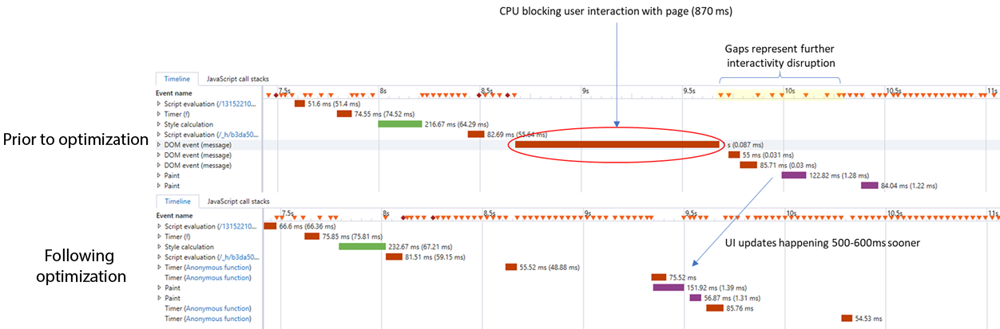

# 방문자 ID 서비스 FAQ{#id-service-faqs}

방문자 ID 서비스 사용과 관련된 기능 및 문제에 대한 FAQ.

## 기능 {#section-659e89f8b9a74cb8afff35587dc96836}

**방문자 ID 서비스에서 제공하는 기능은 무엇입니까?**

[개요](../introduction/overview.md)를 참조하십시오.

**방문자 ID 서비스가 ECID를 검색하기 위해 호출을 하지 않는 이유는 무엇입니까?**

이는 진단이 어려울 수 있습니다. 확인할 수 있는 한 가지는 사이트의 콘텐츠 보안 정책 헤더입니다. 엄격한 보안 정책이 있는 경우 이러한 설정은 방문자 ID 서비스에서 수행하는 서드파티 호출을 차단할 수 있습니다. [콘텐츠 보안 정책 및 방문자 ID 서비스](../reference/csp.md#concept-968c423a7392479db0a0d821ae9783e3)를 참조하십시오.

**`VisitorAPI.js`파일 저장소**

모바일 앱에서 `VisitorAPI.js`을(를) 로컬 파일로 호스팅하면 문제가 발생할 수 있습니다. 웹 서버에서 파일을 호스팅하는 것이 좋습니다.

## 페이지 로드 시간 및 지연 {#section-c78e148d8dbe4c77a436ef0f2af5434b}

**방문자 ID 서비스 `VisitorAPI.js` 라이브러리의 배치가 페이지 로드 시간에 어떻게 영향을 줍니까?**

코드의 `<head>` 섹션에서 페이지 맨 위에 `VisitorAPI.js` 라이브러리를 배치합니다. 이렇게 하면 페이지 본문 로드가 시작되기 전에 ID에 대한 호출이 종료되고 ID가 성공적으로 반환되는 기회를 최대화하는 데 도움이 됩니다.

방문자 ID 서비스 호출은 비동기적으로 수행되며 유일한 [demdex.net 도메인](https://experienceleague.adobe.com/docs/audience-manager/user-guide/reference/demdex-calls.html?lang=ko-KR) 호출입니다. 방문자 ID 서비스 호출은 다른 요소가 페이지에서 로드되는 것을 차단하지 않습니다.

Target 고객의 경우 방문자 ID 서비스 코드를 페이지의 `<body>`에 배치하면 Target 호출을 차단할 가능성이 늘어날 수 있습니다. 방문자 ID 서비스 코드를 페이지의 본문에 배치해야 하는 경우에는 열기 `<body>` 태그 뒤에 배치해야 합니다.

**방문자 ID 서비스가 페이지를 로드할 때마다 서버를 호출합니까?**

아니요. 이 호출은 페이지가 처음으로 렌더링될 때 및 7일에 한 번만 발생합니다. 그 동안에는 서버 호출이 필요하지 않습니다. 방문자 ID 서비스는 클라이언트측 모드에서 작동하며 ID를 반환하기 위해 서버 호출을 수행할 필요가 없습니다.

[개요](../introduction/overview.md)를 참조하십시오.

**방문자 ID 서비스를 사용할 때 페이지 로드 시간이 느려지거나 사용자 경험에 영향을 줄 수 있는 것은 무엇입니까?**

가능한 모든 상황을 분류하는 것은 어렵습니다. 수십 억 명의 사용자 고객이 Adobe 서비스 및 고객 접점이 성능에 영향을 미치는 위치와 방법에 대한 다양한 정보를 연결합니다. 예:

* 모바일 네트워크에서 속도가 매우 다릅니다. 이러한 네트워크는 또한 신호 및 데이터 또는 음성 패킷 손실로 인해 발생합니다.
* 와이파이 접속 디바이스에는 여러 가지 조건이 적용됩니다. 예를 들어, 패킷 손실 및 속도 문제는 커피숍과 같은 공공장소나 혹은 지상 네트워크에 도달하기 전에 위성을 통해 패킷이 반송되어야 하는 항공기와 같은 다른 환경에서는 일반적입니다.
* 잘못 구성된 로컬 네트워크는 연결 및 속도에 부정적인 영향을 줄 수 있습니다.
* 클라이언트 디바이스에는 현재 작업 로드와 관련하여 낮은 메모리, 과도한 디스크 교환 또는 제한된 CPU 성능과 같은 자체 문제가 있을 수 있습니다.
* 브라우저는 브라우저 제조사와 버전에 따라 원격 서버 호출을 큐에 넣고 실행하며 다른 규칙으로 응답을 처리합니다. 이 동작은 속도와 성능에 영향을 줍니다.

**페이지 로드 시간을 단축하기 위한 몇 가지 개선 사항의 이름을 알려 주시겠습니까?**

예를 들어, 스레드 일시 중지가 있습니다. 여러 ID 동기화 요청의 경우 스레드 일시 수익이 도입되었습니다. 랩 보고서에서 여러 ID 동기화를 수행하는 고객의 경우 CPU가 지속적으로 계산되어 UI가 차단되는 것을 발견했습니다. 그 결과, ID 동기화 요청을 각각 100밀리초씩 구분하기 위해 스레드 일시 중지가 도입되었습니다.

이 변경 사항은 Visitor 2.3.0+ 및 DIL 6.10+를 사용하는 고객의 성능을 향상시킵니다. 페이지 로드 시간의 개선은 아래 그림과 같습니다.

**CORS와 JSON-P를 사용하는 브라우저 요청이 페이지 성능에 영향을 줍니까?**

일반적으로 CORS를 사용하는 리소스 요청이 JSONP보다 선호됩니다. JSONP를 사용하는 일부 브라우저는 페이지의 다른 동기 및 비동기 호출과 관련하여 요청을 대기시키고 우선 순위 지정을 취소합니다. CORS는 이러한 요청이 브라우저 호출 스택에서 더 높은 우선 순위로 처리되도록 합니다.

방문자 ID 서비스에서 [CORS 지원](../reference/cors.md#concept-6c280446990d46d88ba9da15d2dcc758)을 참조하십시오.

## 보안 {#section-b176b8492fbe4acfb79ebb30ec902f98}

**방문자 ID 서비스가 CORS를 지원합니까?**

예. 방문자 ID 서비스에서 [CORS 지원](../reference/cors.md#concept-6c280446990d46d88ba9da15d2dcc758)을 참조하십시오.

**CORS란 무엇입니까?**

*`Cross-Origin Resource Sharing`* 또는 CORS는 브라우저에서 리소스를 요청하는 데 사용하는 메서드입니다. 방문자 ID 서비스는 항상 CORS를 지원하는 브라우저에서 리소스를 요청합니다. 방문자 ID 서비스는 CORS를 지원하지 않는 이전 브라우저에서 JSON-P로 리소스를 요청합니다. 방문자 ID 서비스에서 [CORS 지원](../reference/cors.md#concept-6c280446990d46d88ba9da15d2dcc758)을 참조하십시오.

**보안 요구 사항이 너무 엄격하여 JSONP를 사용하지 않을 경우 어떻게 됩니까?**

엄격한 보안 요구 사항이 있는 경우 방문자 ID 서비스 API 구성 `useCORSOnly: true`을(를) 설정하십시오. 사이트 방문자가 CORS를 지원하는 브라우저를 사용한다고 확신하는 경우에만 이 모드를 활성화해야 합니다.

방문자 ID 서비스에서 [CORS 지원](../reference/cors.md#concept-6c280446990d46d88ba9da15d2dcc758) 및 [useCORSOnly](../library/function-vars/use-cors-only.md#reference-8a9a143d838b48d6b23329b84b13e1fa)을 참조하십시오.

>[!MORELIKETHIS]
>
>* [고객 지원 센터](https://helpx.adobe.com/kr/marketing-cloud/contact-support.html)

