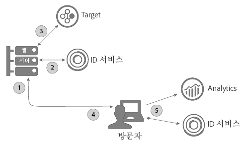
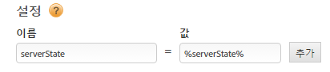

# Target의 서버측 구현 및 A4T에 ID 서비스 사용 {#using-the-id-service-with-a-t-and-a-server-side-implementation-of-target}

이 지침은 Target, Analytics 및 ID 서비스에 대해 혼합된 서버측 및 클라이언트측 구현이 있는 A4T 고객을 위한 것입니다. NodeJS 또는 Rhino 환경에서 ID 서비스를 실행해야 하는 고객도 이 정보를 검토해야 합니다. 이 ID 서비스 인스턴스는 NPM(Node Package Manager)에서 다운로드하여 설치하는 단축된 버전의 VisitorAPI.js 코드 라이브러리를 사용합니다. 이 섹션에서 설치 지침 및 기타 구성 요구 사항을 검토하십시오.

## 소개 {#section-ab0521ff5bbd44c592c3eaab31c1de8b}

A4T(및 기타 고객)는 다음과 같은 작업이 필요한 경우 이 버전의 ID 서비스를 사용할 수 있습니다.

* 서버에서 웹 페이지 콘텐츠를 렌더링하고 최종 표시되도록 브라우저에 전달합니다
* 서버측 [!DNL Target]을 호출합니다.
* [!DNL Analytics]에 클라이언트측(인브라우저) 호출을 해야 하는 경우
* 별개의[!DNL Target] 및 [!DNL Analytics] ID를 동기화하여 한 개의 솔루션에 의해 표시된 방문자가 다른 솔루션에 표시된 방문자와 동일한 인물인지 확인해야 할 경우

## 코드 다운로드 및 제공된 인터페이스 {#section-32d75561438b4c3dba8861be6557be8a}

서버측 코드 패키지를 다운로드하고 현재 빌드에 포함된 인터페이스를 검토하려면 [ID 서비스 NPM 저장소](https://www.npmjs.com/package/@adobe-mcid/visitor-js-server)를 참조하십시오.

## 워크플로 {#section-56b01017922046ed96536404239a272b}

아래 다이어그램과 섹션에서는 서버측 구현 프로세스의 각 단계에서 어떤 상황이 발생하고 무엇을 구성해야 하는지 설명합니다.



## 1단계: 페이지 요청 {#section-c12e82633bc94e8b8a65747115d0dda8}

방문자가 웹 페이지를 로드하기 위해 HTTP 요청을 할 때 서버측 활동이 시작됩니다. 이 단계에서 서버는 이 요청을 수신하고 [AMCV 쿠키](../introduction/cookies.md)를 확인합니다. AMCV 쿠키에는 방문자의 MID([!DNL Experience Cloud] ID)가 포함되어 있습니다.

## 2단계: ID 서비스 페이로드 생성 {#section-c86531863db24bd9a5b761c1a2e0d964}

다음으로, ID 서비스에 서버측 *`payload request`*&#x200B;을 만듭니다. 페이로드 요청:

* AMCV 쿠키를 ID 서비스에 전달합니다.
* 아래에 설명된 후속 단계에서 Target 및 Analytics에 필요한 데이터를 요청합니다.

>[!NOTE]
>
>이 메서드는 [!DNL Target]에서 단일 mbox를 요청합니다. 한 번의 호출로 여러 mbox를 요청해야 하는 경우 [generateBatchPayload](https://www.npmjs.com/package/@adobe-mcid/visitor-js-server#generatebatchpayload)를 참조하십시오.

페이로드 요청은 다음 코드 샘플과 유사해야 합니다. 코드 샘플에서 `visitor.setCustomerIDs` 함수는 선택 사항입니다. 자세한 내용은 [고객 ID 및 인증 상태](../reference/authenticated-state.md)를 참조하십시오.

```js
//Import the ID service server package 
var Visitor = require("@adobe-mcid/visitor-js-server"); 
 
//Pass in your Organization ID to instantiate Visitor 
var visitor = new Visitor("Insert Experience Cloud ID here"); 
 
// 
<i>(Optional)</i> Set a custom customer ID 
visitor.setCustomerIDs({ 
     userid:{ 
          id:"1234", 
          authState: Visitor.AuthState.UNKNOWN //AuthState is a static property of the Visitor class 
     } 
}); 
 
//Parse the visitor's HTTP request for the AMCV cookie 
var cookies = cookie.parse(req.headers.cookie || ""); 
var cookieName = visitor.getCookieName(); // Visitor API that returns the cookie name. 
var amcvCookie = cookies[cookieName]; 
 
//Generate the payload request pass your mbox name and the AMCV cookie if present 
var visitorPayload = visitor.generatePayload({ 
     mboxName: "bottom-banner-mbox", 
     amcvCookie: amcvCookie 
});
```

ID 서비스는 JSON 개체에 다음 예제와 유사한 페이로드를 반환합니다. 페이로드 데이터는 [!DNL Target]에 필요합니다.

```js
{ 
    "marketingCloudVisitorId": "02111696918527575543455026275721941645", 
    "mboxParameters": { 
        "mboxAAMB": "abcd1234", 
        "mboxMCGLH": "9", 
        "mboxMCSDID": "56BE026543F7E211-1CC51BCAAE88F0D2", 
        "vst.userid.id": "1234567890", 
        "vst.userid.authState": 0 
    } 
}
```

방문자에게 AMCV 쿠키가 없는 경우 페이로드에서 다음과 같은 키-값 쌍을 생략합니다.

* `marketingCloudvisitorId`
* `mboxAAMB`
* `mboxMCGLH`

## 3단계: Target 호출에 페이로드 추가 {#section-62451aa70d2f44ceb9fd0dc2d4f780f7}

서버가 ID 서비스에서 페이로드 데이터를 수신하면 [!DNL Target]에 전달된 데이터와 병합하기 위해 추가 코드를 인스턴스화해야 합니다. [!DNL Target]에 전달된 마지막 JSON 개체는 다음과 유사합니다.

```js
{ 
"mbox" : "target-global-mbox", 
"marketingCloudVisitorId":"02111696918527575543455026275721941645", 
"requestLocation" : { 
     "pageURL" : "http://www.domain.com/test/demo.html", 
     "host" : "localhost:3000" 
     }, 
"mboxParameters" : { 
     "mboxAAMB" : "abcd1234", 
     "mboxMCGLH" : "9", 
     "mboxMCSDID": "56BE026543F7E211-1CC51BCAAE88F0D2", 
     "vst.userid.id": "1234567890", 
     "vst.userid.authState": 0, 
     } 
} 
```

## 4단계: ID 서비스의 서버 상태 가져오기 {#section-8ebfd177d42941c1893bfdde6e514280}

서버 상태 데이터에는 서버에서 수행된 작업에 대한 정보가 포함됩니다. 클라이언트측 ID 서비스 코드에는 이 정보가 필요합니다. DTM([!DNL Dynamic Tag Manager])을 통해 ID 서비스를 구현한 고객은 해당 도구를 통해 서버 상태 데이터를 전달하도록 DTM을 구성할 수 있습니다. 비표준 프로세스를 통해 ID 서비스를 설정한 경우 자체 코드와 함께 서버 상태를 반환해야 합니다. 클라이언트측 ID 서비스와 [!DNL Analytics] 코드는 페이지가 로드될 때 상태 데이터를 Adobe에 전달합니다.

**DTM을 통해 서버 상태 가져오기**

DTM으로 ID 서비스를 구현한 경우, 페이지에 코드를 추가하고 DTM 설정에 이름-값 쌍을 지정해야 합니다.

**페이지 코드**

다음 코드를 HTML 페이지의 `<head>` 태그에 추가합니다.

```js
//Get server state 
var serverState = visitor.getState(); 
 
Response.send(" 
... 
<head> 
     <script> 
          //Add 'serverState' as a stringified JSON global variable. 
          "var serverState = "+ JSON.stringify(serverState) +";  
     </script> 
     <script src = "DTM script (satellite JS)"> 
     </script> 
</head> 
...
```

**DTM 설정**

다음 코드를 ID 서비스 인스턴스의 **[!UICONTROL 일반 > 설정]** 섹션에 이름-값 쌍으로 추가합니다.

* **[!UICONTROL 이름:]** serverState
* **[!UICONTROL 값:]** %serverState%

   >[!IMPORTANT]
   >
   >값 이름은 페이지 코드의 `serverState`에 설정한 변수 이름과 일치해야 합니다.

구성된 설정은 다음과 같습니다.



**DTM을 사용하지 않고 서버 상태 가져오기**

ID 서비스의 비표준 구현을 보유한 경우, 다음 코드를 구성하여 요청된 페이지를 결합하는 동안 서버에서 실행해야 합니다.

```js
//Get server state 
var serverState = visitor.getState(); 
 
Response.send(" 
... 
<head> 
     <script src="VisitorAPI.js"></script> 
     <script> 
          var visitor = Visitor.getInstance(orgID, { 
          serverState: serverState  
          ... 
     </script> 
</head> 
...
```

## 5단계: 페이지 제공 및 Experience Cloud 데이터 반환 {#section-4b5631a0d75a41febd6f43f8c214c263}

이때 웹 서버는 방문자의 브라우저에 페이지 콘텐츠를 전송합니다. 이 시점에서부터 브라우저(서버가 아님)가 나머지 모든 ID 서비스와 [!DNL Analytics] 호출을 수행합니다. 예를 들어 브라우저에서:

* ID 서비스는 서버에서 상태 데이터를 수신하고 SDID를 AppMeasurement로 전달합니다.
* AppMeasurement가 SDID를 포함하여 페이지 조회수에 관한 데이터를 [!DNL Analytics]에 전달합니다.
* [!DNL Analytics] 및 [!DNL Target]에서 해당 방문자의 SDID를 비교합니다. SDID가 일치하면 [!DNL Target] 및 [!DNL Analytics]가 서버측 호출과 클라이언트측 호출을 함께 결합합니다. 이제 두 개의 솔루션에서 해당 방문자를 동일한 사람으로 인지합니다.

>[!MORELIKETHIS]
>
>* [노드 패키지 관리자의 서버측 ID 서비스 패키지](https://www.npmjs.com/package/@adobe-mcid/visitor-js-server)

