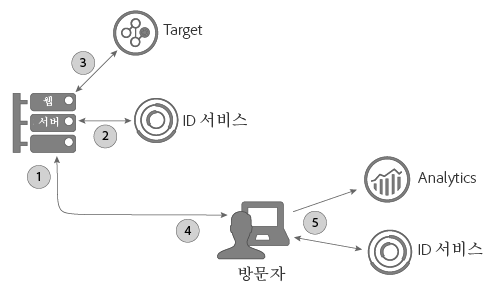

# Target의 서버측 구현 및 A4T에 방문자 ID 서비스 사용 {#using-the-id-service-with-a-t-and-a-server-side-implementation-of-target}

이러한 지침은 Target, Analytics 및 방문자 ID 서비스에 대한 서버측과 클라이언트측 구현이 혼합된 A4T 고객을 대상으로 합니다. NodeJS 또는 Rhino 환경에서 방문자 ID 서비스를 실행해야 하는 고객도 이 정보를 검토해야 합니다. 이 방문자 ID 서비스 인스턴스는 NPM(Node Package Manager)에서 다운로드하여 설치하는 단축된 버전의 `VisitorAPI.js` 코드 라이브러리를 사용합니다. 이 섹션에서 설치 지침 및 기타 구성 요구 사항을 검토하십시오.

## 소개 {#section-ab0521ff5bbd44c592c3eaab31c1de8b}

A4T(및 기타 고객)는 다음 작업을 수행해야 하는 경우 이 버전의 방문자 ID 서비스를 사용할 수 있습니다.

* 서버에서 웹 페이지 콘텐츠를 렌더링하고 최종 표시되도록 브라우저에 전달합니다
* 서버측 Target을 호출합니다.
* Analytics에 클라이언트측(인브라우저) 호출을 해야 합니다.
* 별도의 Target 및 Analytics ID를 동기화하여 한 개의 솔루션에 의해 표시된 방문자가 다른 솔루션에 표시된 방문자와 동일한 인물인지 확인해야 할 경우

## 코드 다운로드 및 제공된 인터페이스 {#section-32d75561438b4c3dba8861be6557be8a}

서버측 코드 패키지를 다운로드하고 현재 빌드에 포함된 인터페이스를 검토하려면 [방문자 ID 서비스 NPM 저장소](https://www.npmjs.com/package/@adobe-mcid/visitor-js-server)를 참조하십시오.

## 워크플로 {#section-56b01017922046ed96536404239a272b}

아래 다이어그램과 섹션에서는 서버측 구현 프로세스의 각 단계에서 어떤 상황이 발생하고 무엇을 구성해야 하는지 설명합니다.



## 1단계: 페이지 요청 {#section-c12e82633bc94e8b8a65747115d0dda8}

방문자가 웹 페이지를 로드하기 위해 HTTP 요청을 할 때 서버측 활동이 시작됩니다. 이 단계에서 서버는 이 요청을 수신하고 [AMCV 쿠키](../introduction/cookies.md)를 확인합니다. AMCV 쿠키에는 방문자의 ECID가 포함되어 있습니다.

## 2단계: 방문자 ID 서비스 페이로드 생성 {#section-c86531863db24bd9a5b761c1a2e0d964}

다음으로 방문자 ID 서비스에 서버측 *`payload request`*&#x200B;을(를) 만듭니다. 페이로드 요청:

* AMCV 쿠키를 방문자 ID 서비스에 전달합니다.
* 아래에 설명된 후속 단계에서 Target 및 Analytics에 필요한 데이터를 요청합니다.

>[!NOTE]
>
>이 메서드는 Target에서 단일 mbox를 요청합니다. 한 번의 호출로 여러 mbox를 요청해야 하는 경우 [generateBatchPayload](https://www.npmjs.com/package/@adobe-mcid/visitor-js-server#generatebatchpayload)를 참조하십시오.

페이로드 요청은 다음 코드 샘플과 유사해야 합니다. 코드 샘플에서 `visitor.setCustomerIDs` 함수는 선택 사항입니다. 자세한 내용은 [고객 ID 및 인증 상태](../reference/authenticated-state.md)를 참조하십시오.

```js
//Import the Visitor ID Service server package 
var Visitor = require("@adobe-mcid/visitor-js-server"); 
 
//Pass in your IMS org ID to instantiate Visitor 
var visitor = new Visitor("Insert ECID here"); 
 
// 
<i>(Optional)</i> Set a custom customer ID 
visitor.setCustomerIDs({ 
     userid:{ 
          id:"1234", 
          authState: Visitor.AuthState.UNKNOWN //AuthState is a static property of the Visitor class 
     } 
}); 
 
//Parse the visitor's HTTP request for the AMCV cookie 
var cookies = cookie.parse(req.headers.cookie || ""); 
var cookieName = visitor.getCookieName(); // Visitor API that returns the cookie name. 
var amcvCookie = cookies[cookieName]; 
 
//Generate the payload request pass your mbox name and the AMCV cookie if present 
var visitorPayload = visitor.generatePayload({ 
     mboxName: "bottom-banner-mbox", 
     amcvCookie: amcvCookie 
});
```

방문자 ID 서비스는 다음 예제와 유사한 JSON 개체에 페이로드를 반환합니다. Target에 페이로드 데이터가 필요합니다.

```js
{ 
    "marketingCloudVisitorId": "02111696918527575543455026275721941645", 
    "mboxParameters": { 
        "mboxAAMB": "abcd1234", 
        "mboxMCGLH": "9", 
        "mboxMCSDID": "56BE026543F7E211-1CC51BCAAE88F0D2", 
        "vst.userid.id": "1234567890", 
        "vst.userid.authState": 0 
    } 
}
```

방문자에게 AMCV 쿠키가 없는 경우 페이로드에서 다음과 같은 키-값 쌍을 생략합니다.

* `marketingCloudvisitorId`
* `mboxAAMB`
* `mboxMCGLH`

## 3단계: Target 호출에 페이로드 추가 {#section-62451aa70d2f44ceb9fd0dc2d4f780f7}

서버가 방문자 ID 서비스에서 페이로드 데이터를 수신하면 Target에 전달된 데이터와 병합하기 위해 추가 코드를 인스턴스화해야 합니다. Target에 전달된 최종 JSON 개체는 다음과 유사합니다.

```js
{ 
"mbox" : "target-global-mbox", 
"marketingCloudVisitorId":"02111696918527575543455026275721941645", 
"requestLocation" : { 
     "pageURL" : "http://www.domain.com/test/demo.html", 
     "host" : "localhost:3000" 
     }, 
"mboxParameters" : { 
     "mboxAAMB" : "abcd1234", 
     "mboxMCGLH" : "9", 
     "mboxMCSDID": "56BE026543F7E211-1CC51BCAAE88F0D2", 
     "vst.userid.id": "1234567890", 
     "vst.userid.authState": 0, 
     } 
} 
```

## 4단계: 방문자 ID 서비스에 대한 서버 상태 가져오기 {#section-8ebfd177d42941c1893bfdde6e514280}

서버 상태 데이터에는 서버에서 수행된 작업에 대한 정보가 포함됩니다. 클라이언트측 방문자 ID 서비스 코드에는 이 정보가 필요합니다. 비표준 프로세스를 통해 방문자 ID 서비스를 설정한 경우 자체 코드와 함께 서버 상태를 반환해야 합니다. 클라이언트측 방문자 ID 서비스 및 Analytics 코드는 페이지가 로드될 때 상태 데이터를 Adobe에 전달합니다.

방문자 ID 서비스의 비표준 구현이 있는 경우, 이 코드가 요청된 페이지를 결합하는 동안 서버에서 실행되도록 구성해야 합니다.

```js
//Get server state 
var serverState = visitor.getState(); 
 
Response.send(" 
... 
<head> 
     <script src="VisitorAPI.js"></script> 
     <script> 
          var visitor = Visitor.getInstance(orgID, { 
          serverState: serverState  
          ... 
     </script> 
</head> 
...
```

## 5단계: 페이지 제공 및 CX 엔터프라이즈 데이터 반환 {#section-4b5631a0d75a41febd6f43f8c214c263}

이때 웹 서버는 방문자의 브라우저에 페이지 콘텐츠를 전송합니다. 이 시점에서부터 브라우저(서버가 아님)가 나머지 모든 방문자 ID 서비스 및 Analytics 호출을 수행합니다. 예를 들어 브라우저에서:

* 방문자 ID 서비스는 서버에서 상태 데이터를 수신하고 SDID를 AppMeasurement에 전달합니다.
* AppMeasurement은 SDID를 포함하여 페이지 조회수에 대한 데이터를 Analytics에 보냅니다.
* Analytics와 Target은 이 방문자의 SDID를 비교합니다. SDID가 일치하면 Target과 Analytics가 서버측 호출과 클라이언트측 호출을 함께 결합합니다. 이제 두 개의 솔루션에서 해당 방문자를 동일한 사람으로 인지합니다.

>[!MORELIKETHIS]
>
>* [노드 패키지 관리자의 서버측 방문자 ID 서비스 패키지](https://www.npmjs.com/package/@adobe-mcid/visitor-js-server)

