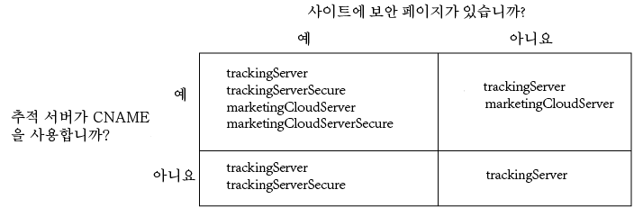

# Analytics, Audience Manager 및 Target용 Experience Cloud ID 서비스 구현 {#implement-the-experience-cloud-id-service-for-analytics-audience-manager-and-target}

이 지침은 Analytics, Audience Manager 및 Experience Cloud ID 서비스를 사용하고 DTM (다이내믹 태그 관리) 를 사용하지 않으려는 Target 고객을 대상으로 합니다. 하지만 ID 서비스를 구현하려면 DTM을 사용하는 것이 좋습니다. DTM은 구현 작업 과정을 간소하게 하고 올바른 코드 배치 및 시퀀스를 자동으로 보장합니다.

>[!IMPORTANT]
>
>Read the ID service [requirements](../reference/requirements.md) before you begin and note the following requirements that are specific to this implementation: &gt;
>* s_code를 사용하는 고객은 이 절차를 완료할 수 없습니다. mbox 코드 v61로 업그레이드하여 이 절차를 완료할 수 있습니다.
>* 프로덕션 환경에서 구현하기 *전에* 개발 환경에서 이 코드를 구성하고 테스트하십시오.
>


## Step 1: Plan for server-side forwarding {#section-880797cc992d4755b29cada7b831f1fc}

여기에 설명된 단계 외에도 [!DNL Analytics] 및 [!DNL Audience Manager]를 사용하는 고객은 서버측 전달로 마이그레이션해야 합니다. 서버측 전달을 통해 DIL(Audience Manager의 데이터 수집 코드)을 제거하고 [대상 관리 모듈](https://marketing.adobe.com/resources/help/en_US/aam/c_profiles_audiences.html)로 교체할 수 있습니다. 자세한 내용은 [서버측 전달 설명서](https://marketing.adobe.com/resources/help/en_US/reference/ssf.html)를 참조하십시오.

서버측 전달로 마이그레이션하려면 계획과 조정이 필요합니다. 이 프로세스에는 사이트 코드에 대한 외부 변경 사항과 Adobe에서 계정을 프로비저닝하기 위해 수행해야 하는 내부 단계가 포함됩니다. 사실상 이러한 마이그레이션 절차의 대부분은 동시에 수행되어 함께 릴리스되어야 합니다. 사용자의 구현 경로는 다음 이벤트 시퀀스를 따라야 합니다.

1. [!DNL Analytics] 및 [!DNL Audience Manager] 담당자와 협업하여 ID 서비스 및 서버측 전달 마이그레이션을 계획합니다. 이 계획에서 추적 서버 선택을 중요한 부분으로 다룹니다.

1. [!DNL Profiles & Audiences]프로비저닝받기. [ 통합 및 프로비저닝 사이트](https://adobe.allegiancetech.com/cgi-bin/qwebcorporate.dll?idx=X8SVES)에서 양식을 작성하여 시작합니다.

1. Implement the ID service and the [!DNL Audience Management Module] simultaneously. To work properly, the [!DNL Audience Management Module] (server-side forwarding) and the ID service must be released for the same set of pages and at the same time.

## Step 2: Download the ID Service code {#section-0780126cf43e4ad9b6fc5fe17bb3ef86}

ID 서비스에는 `VisitorAPI.js` 코드 라이브러리가 필요합니다. 이 코드 라이브러리를 다운로드하려면

1. **[!UICONTROL 관리 &gt; 코드 관리자로 이동합니다]**.
1. In Code Manager, click either **[!UICONTROL JavaScrpt (New)]** or **[!UICONTROL JavaScript (Legacy)]**. 이렇게 하면 압축된 코드 라이브러리가 다운로드됩니다.

1. 코드 파일의 압축을 풀고 `VisitorAPI.js` 파일을 엽니다.

## Step 3: Add the Visitor.getInstance function to the ID Service code {#section-9e30838b4d0741658a7a492153c49f27}

>[!IMPORTANT]
>
>* 이전 버전의 ID 서비스 API에서는 이 함수가 다른 위치에 있으므로 다른 구문이 필요합니다. [버전 1.4](../release-notes/notes-2015.md#section-f5c596f355b14da28f45c798df513572) 이전 버전에서 마이그레이션하는 경우에는 여기에 설명된 새 위치 및 구문을 확인하십시오.
>* 모두 대문자로 된 코드는 실제 값의 자리 표시자입니다. 이 텍스트를 조직 ID, 추적 서버 URL 또는 이름이 지정된 기타 값으로 바꿉니다.
>


**1부: 아래의 Visitor.getInstance 함수 복사**

```js
var visitor = Visitor.getInstance("INSERT-MARKETING-CLOUD-ORGANIZATION ID-HERE", { 
     trackingServer: "INSERT-TRACKING-SERVER-HERE", // same as s.trackingServer 
     trackingServerSecure: "INSERT-SECURE-TRACKING-SERVER-HERE", // same as s.trackingServerSecure 
 
     // To enable CNAME support, add the following configuration variables 
     // If you are not using CNAME, DO NOT include these variables 
     marketingCloudServer: "INSERT-TRACKING-SERVER-HERE", 
     marketingCloudServerSecure: "INSERT-SECURE-TRACKING-SERVER-HERE" // same as s.trackingServerSecure 
}); 
```

**2부: 함수 코드를 방문자 API.js 파일에 추가**

`Visitor.getInstance` 함수를 파일 끝, 코드 블록 뒤에 추가합니다. 편집한 파일은 다음과 같습니다.

```js
/* 
========== DO NOT ALTER ANYTHING BELOW THIS LINE ========== 
Version and copyright section 
*/ 
 
// Visitor API code library section 
 
// Put Visitor.getInstance at the end of the file, after the code library 
 
var visitor = Visitor.getInstance("INSERT-MARKETING-CLOUD-ORGANIZATION ID-HERE", { 
     trackingServer: "INSERT-TRACKING-SERVER-HERE", // same as s.trackingServer 
     trackingServerSecure: "INSERT-SECURE-TRACKING-SERVER-HERE", // same as s.trackingServerSecure 
 
     // To enable CNAME support, add the following configuration variables 
     // If you are not using CNAME, DO NOT include these variables 
     marketingCloudServer: "INSERT-TRACKING-SERVER-HERE", 
     marketingCloudServerSecure: "INSERT-SECURE-TRACKING-SERVER-HERE" // same as s.trackingServerSecure 
}); 
```

## Step 4: Add your Experience Cloud Organization ID to Visitor.getInstance {#section-e2947313492546789b0c3b2fc3e897d8}

`Visitor.getInstance` 함수에서 Experience Cloud 조직 ID `INSERT-MARKETING-CLOUD-ORGANIZATION ID-HERE` 로 바꿉니다. 조직 ID를 모를 경우 Experience Cloud 관리 페이지에서 찾을 수 있습니다. 편집한 함수는 아래 예제와 비슷합니다.

`var visitor = Visitor.getInstance("1234567ABC@AdobeOrg", { ...`

>[!IMPORTANT]
>
>*조직 ID에서 문자의 대소문자를* 변경하지 마십시오. ID는 대/소문자를 구분하므로 제공된 그대로 정확히 사용해야 합니다.

## Step 5: Add your tracking servers to Visitor.getInstance {#section-0dfc52096ac2427f86045aab9a0e0dfc}

Analytics는 데이터 수집 시 추적 서버를 사용합니다.

**1부: 추적 서버 URL 찾기**

`s_code.js` 또는 `AppMeasurement.js` 파일을 확인하여 추적 서버 URL를 찾습니다. URL을 다음 변수로 지정할 수 있습니다.

* `s.trackingServer`
* `s.trackingServerSecure`

**2부: 추적 서버 변수 설정**

사용할 추적 서버 변수를 확인하려면

1. 아래의 의사 결정 매트릭스에 제시된 질문에 답변합니다. 답변에 해당하는 변수를 사용합니다.
1. 추적 서버 자리 표시자를 추적 서버 URL로 바꿉니다.
1. 사용하지 않은 추적 서버 및 Experience Cloud 서버 변수를 코드에서 제거합니다.



>[!NOTE]
>
>사용 시 다음과 같은 해당 추적 서버 URL에 Experience Cloud 서버 URL를 일치시킵니다.

* Experience Cloud 서버 URL = 추적 서버 URL
* Experience Cloud 서버 보안 URL = 추적 서버 보안 URL

추적 서버를 찾는 방법을 모를 경우 [FAQ](../faq-intro/faq.md)와 [trackingServer 및 trackingServerSecure 변수 올바로 채우기를 참조하십시오](https://helpx.adobe.com/analytics/kb/determining-data-center.html#).

## Step 6: Update your AppMeasurement.js file {#section-5517e94a09bc44dfb492ebca14b43048}

This step requires [!DNL AppMeasurement]. s_code를 사용하는 경우 계속 진행할 수 없습니다.

Add the `Visitor.getInstance` function shown below to your `AppMeasurement.js` file. Place it in the section that contains configurations such as `linkInternalFilters`, `charSet`, `trackDownloads`, etc. :

`s.visitor = Visitor.getInstance("INSERT-MARKETING-CLOUD-ORGANIZATION ID-HERE");`

>[!IMPORTANT]
>
>At this point, you should remove the [!DNL Audience Manager] DIL code and replace it with the Audience Management Module. 지침은 [서버측 전달 구현](https://marketing.adobe.com/resources/help/en_US/reference/ssf.html)을 참조하십시오.

***(선택 사항이지만 권장됨)*사용자 지정 Prop 만들기**

`AppMeasurement.js`에 사용자 지정 prop을 설정하여 범위를 측정. 이 사용자 지정 prop을 `doPlugins` 파일의 `AppMeasurement.js` 함수에 추가합니다.

```js
// prop1 is used as an example only. Choose any available prop. 
s.prop1 = (typeof(Visitor) != "undefined" ? "VisitorAPI Present" : "VisitorAPI Missing");
```

## Step 7: Add Visitor API code to the page {#section-c2bd096a3e484872a72967b6468d3673}

Place the ` [!DNL VisitorAPI.js]` file within the `<head>` tags on each page. `VisitorAPI.js` 파일을 페이지에 넣을 경우:

* `<head>` 섹션 맨 앞에 배치하면 다른 솔루션 태그 앞에 표시됩니다.
* AppMeasurement 및 다른 [!DNL Experience Cloud] 솔루션에 대한 코드 앞에서 실행해야 합니다.

## Step 8: (Optional) Configure a grace period {#section-aceacdb7d5794f25ac6ff46f82e148e1}

If any of these use cases apply to your situation, ask [Customer Care](https://helpx.adobe.com/marketing-cloud/contact-support.html) to set up a temporary [grace period](../reference/analytics-reference/grace-period.md). 유예 기간은 최대 180일 동안 실행할 수 있습니다. 필요한 경우 유예 기간을 갱신할 수 있습니다.

**부분적인 구현**

ID 서비스를 사용하는 페이지도 있고 그렇지 않은 페이지도 있으며 이러한 모든 페이지가 동일한 Analytics 보고서 세트로 보고하는 경우에 유예 기간이 필요합니다. 이러한 상황은 여러 도메인 간에 보고를 수행하는 전역 보고서 세트가 있는 경우에 일반적입니다.

ID 서비스가 동일한 보고서 세트에 보고하는 모든 웹 페이지에 배포된 후에 유예 기간을 중단하십시오.

**s_vi Cookie 요구 사항**

ID 서비스로 마이그레이션한 후에 새 방문자가 s_vi 쿠키를 보유해야 하는 경우 유예 기간이 필요합니다. 이러한 상황은 구현에 s_vi 쿠키가 필요하고 이러한 쿠키가 변수에 저장되는 경우에 일반적입니다.

구현이 s_vi 쿠키를 읽는 대신 MID를 캡처할 수 있게 되면 유예 기간을 중단하십시오.

[쿠키 및 Experience Cloud ID 서비스를 참조하십시오](../introduction/cookies.md).

**클릭스트림 데이터 통합**

클릭스트림 데이터 피드에서 내부 시스템으로 데이터를 보내고 해당 프로세스에서 `visid_high` 및 `visid_low` 열이 사용되는 경우에 유예 기간이 필요합니다.

Discontinue the grace period after your data ingestion process can use the `post_visid_high` and `post_visid_low` columns.

또한 [클릭스트림 데이터 열 참조](https://marketing.adobe.com/resources/help/en_US/sc/clickstream/datafeeds_reference.html)를 참조하십시오.

## Step 9: Test and verify {#section-f857542bfc70496dbb9f318d6b3ae110}

이 구현에서 [!DNL Experience Cloud] 솔루션은 키-값 쌍 형태로 ID를 반환합니다. 각 솔루션은 서로 다른 키(예: [!DNL Analytics] SDID와 [!DNL Target] mboxMCSDID)를 사용하여 동일한 ID를 보유합니다. 구현을 테스트하려면 배포 환경에서 페이지를 로드하십시오. 아래 나열된 ID 확인을 위해 HTTP 요청과 응답을 모니터링하는 브라우저 콘솔이나 소프트웨어를 사용합니다. 아래에 나열된 키-값 쌍이 동일한 ID 값을 반환하면 ID 서비스가 제대로 구현된 것입니다.

>[!TIP]
>
>[Adobe Debugger](https://marketing.adobe.com/resources/help/en_US/sc/implement/?f=debugger.html) 또는 [Charles HTTP 프록시를](https://www.charlesproxy.com/) 사용하여 이러한 솔루션별 ID를 확인할 수 있습니다. 하지만 가장 적합한 도구나 디버거를 자유롭게 사용할 수 있습니다.

**모든 솔루션**

다음 사항을 확인합니다.

* [페이지가 호스팅된 도메인의 AMCV 쿠키](../introduction/cookies.md).
* [!DNL Experience Cloud] ID (MID) [!DNL Adobe] 를 사용하십시오.

For additional checks that help you determine if the ID service is working properly, see [Test and Verify the Experience Cloud ID Service](../implementation-guides/test-verify.md).

**Analytics**

JavaScript 요청에서 SDID 식별자를 확인합니다. Analytics SDID는 Target mboxMCSDID와 일치해야 합니다.

테스트에서 AID를 반환하면 다음 중 한 가지를 나타내는 것입니다.

* 기존 [!DNL Analytics] ID를 마이그레이션하는 과정에 있는 재방문자입니다.
* [유예 기간이](../reference/analytics-reference/grace-period.md) 활성화되어 있습니다.

AID가 표시되면 [!DNL Target] mboxMCAVID에 대해 해당 값을 확인합니다. ID 서비스가 제대로 구현된 경우 이러한 값이 동일합니다.

**Audience Manager**

서버측 전달을 테스트하려면 다음을 참조하십시오.

* [계정에서 전달된 데이터를 수신할 준비가 되었는지 확인하는 방법](https://marketing.adobe.com/resources/help/en_US/aam/ssf-success.html)
* [계정에서 전달된 데이터를 수신할 준비가 되지 않았는지 확인하는 방법](https://marketing.adobe.com/resources/help/en_US/aam/ssf-fail.html)

**Target**

다음 사항을 확인합니다.

* mboxMCGVID
* mboxMCSDID(mboxMCSDID가 Analytics SDID와 일치해야 함)

테스트에서 mboxMCAVID를 반환하면 다음 중 한 가지를 나타냅니다.

* 기존 [!DNL Analytics] ID를 마이그레이션하는 과정에 있는 재방문자입니다.
* 유예 기간을 활성화했습니다.

mboxMCAVID가 표시되면 [!DNL Analytics] AID에 대해 해당 값을 확인합니다. ID 서비스가 제대로 구현된 경우 이러한 값이 동일합니다.

**배포**

## Step 10: Deploy {#section-4188fa95e7dc455a986b48a6c517c1c9}

테스트를 통과한 후에 코드를 배포하십시오.

유예 기간을 활성화한 경우:

* 이미지 요청에 AID(Analytics ID) 및 MID가 있는지 확인합니다.
* [중단 기준](../implementation-guides/setup-aam-analytics-target.md#section-aceacdb7d5794f25ac6ff46f82e148e1)을 충족한 경우 유예 기간을 비활성화하십시오.

