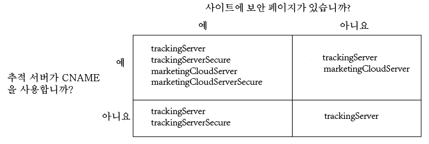

# Analytics 및 Audience Manager용 Experience Cloud ID 서비스 구현{#implement-the-experience-cloud-id-service-for-analytics-and-audience-manager}

이러한 지침은 Experience Cloud ID 서비스를 사용하고 사용하지 않으려는 Analytics 및 Audience Manager 고객을 대상으로 합니다 [데이터 수집 태그](https://experienceleague.adobe.com/docs/experience-platform/tags/home.html?lang=ko-KR). 그러나 태그를 사용하여 ID 서비스를 구현하는 것이 좋습니다. 태그는 구현 워크플로를 간소화하고 올바른 코드 배치 및 순서를 자동으로 보장합니다.

>[!IMPORTANT]
>
>* [시작하기 전에 요구 사항을 읽어보십시오](../reference/requirements.md).
>* 이 절차에는 AppMeasurement가 필요합니다. s_code를 사용하는 고객은 이 절차를 완료할 수 없습니다.
>* 프로덕션 환경에서 구현하기 전에 개발 환경에서 이 코드를 구성하고 테스트하십시오.

## 1단계: 서버측 전달 플랜 {#section-880797cc992d4755b29cada7b831f1fc}

여기에 설명된 단계 외에도 [!DNL Analytics] 및 [!DNL Audience Manager]를 사용하는 고객은 서버측 전달로 마이그레이션해야 합니다. 서버측 전달을 통해 DIL(Audience Manager의 데이터 수집 코드)을 제거하고 [고객 관리 모듈](https://experienceleague.adobe.com/docs/audience-manager/user-guide/implementation-integration-guides/integration-other-solutions/audience-management-module.html?lang=ko-KR)로 대체합니다. 자세한 내용은 [서버측 전달 설명서](https://experienceleague.adobe.com/docs/analytics/admin/admin-tools/manage-report-suites/edit-report-suite/report-suite-general/server-side-forwarding/ssf.html)를 참조하십시오.

서버측 전달로 마이그레이션하려면 계획 및 조정이 필요합니다. 이 프로세스에는 계정을 프로비저닝하기 위해 Adobe가 수행해야 하는 사이트 코드와 내부 단계에 대한 외부 변경 사항이 포함됩니다. 실제로 이러한 마이그레이션 절차는 대부분 동시에 수행되어야 하며 함께 출시됩니다. 구현 경로는 다음 이벤트 시퀀스를 따라야 합니다.

1. [!DNL Analytics] 및 [!DNL Audience Manager] 담당자와 협업하여 ID 서비스 및 서버측 전달 마이그레이션을 계획합니다. 이 계획에서 추적 서버 선택을 중요한 부분으로 다룹니다.

1. 시작하려면 [통합 및 프로비저닝 사이트](https://adobe.allegiancetech.com/cgi-bin/qwebcorporate.dll?idx=X8SVES)에서 양식을 작성합니다.

1. ID 서비스와 [!DNL Audience Management Module]을 동시에 구현합니다. 제대로 작동하려면 [!DNL Audience Management Module] (서버측 전달) 및 ID 서비스를 동시에 같은 페이지 세트에 대해 릴리스해야 합니다.

## 2단계: ID 서비스 코드 다운로드 {#section-0780126cf43e4ad9b6fc5fe17bb3ef86}

ID 서비스에는 `VisitorAPI.js` 코드 라이브러리가 필요합니다. 이 코드 라이브러리를 다운로드하려면

1. **[!UICONTROL 관리자]** > **[!UICONTROL 코드 관리자]**&#x200B;로 이동합니다.

1. 코드 관리자에서 **[!UICONTROL JavaScript(신규)]** 또는 **[!UICONTROL JavaScript(기존)]**&#x200B;를 클릭합니다. 이렇게 하면 압축된 코드 라이브러리가 다운로드됩니다.

1. 코드 파일의 압축을 풀고 `VisitorAPI.js` 파일을 엽니다.

## 3단계: ID 서비스 코드에 Visitor.getInstance 함수 추가 {#section-9e30838b4d0741658a7a492153c49f27}

>[!IMPORTANT]
>
>* 이전 버전의 ID 서비스 API는 이 함수를 다른 위치에 배치했으며 다른 구문이 필요합니다. [버전 1.4](../release-notes/notes-2015.md#section-f5c596f355b14da28f45c798df513572) 이전 버전에서 마이그레이션하는 경우 여기에 설명된 새 배치 및 구문을 참고하십시오.
>* ALL CAPS의 코드는 실제 값의 자리 표시자입니다. 이 텍스트를 조직 ID, 추적 서버 URL 또는 기타 명명된 값으로 바꿉니다.

**1부: 아래 Visitor.getInstance 함수 복사**

```js
var visitor = Visitor.getInstance("INSERT-MARKETING-CLOUD-ORGANIZATION ID-HERE", { 
     trackingServer: "INSERT-TRACKING-SERVER-HERE", // same as s.trackingServer 
     trackingServerSecure: "INSERT-SECURE-TRACKING-SERVER-HERE", // same as s.trackingServerSecure 
 
     // To enable CNAME support, add the following configuration variables 
     // If you are not using CNAME, DO NOT include these variables 
     marketingCloudServer: "INSERT-TRACKING-SERVER-HERE", 
     marketingCloudServerSecure: "INSERT-SECURE-TRACKING-SERVER-HERE" // same as s.trackingServerSecure 
}); 
```

**2부: Visitor API.js 파일에 함수 코드 추가**

`Visitor.getInstance` 함수를 파일 끝, 코드 블록 뒤에 추가합니다. 편집한 파일은 다음과 같습니다.

```js
/* 
========== DO NOT ALTER ANYTHING BELOW THIS LINE ========== 
Version and copyright section 
*/ 
 
// Visitor API code library section 
 
// Put Visitor.getInstance at the end of the file, after the code library 
 
var visitor = Visitor.getInstance("INSERT-MARKETING-CLOUD-ORGANIZATION ID-HERE", { 
     trackingServer: "INSERT-TRACKING-SERVER-HERE", // same as s.trackingServer 
     trackingServerSecure: "INSERT-SECURE-TRACKING-SERVER-HERE", // same as s.trackingServerSecure 
 
     // To enable CNAME support, add the following configuration variables 
     // If you are not using CNAME, DO NOT include these variables 
     marketingCloudServer: "INSERT-TRACKING-SERVER-HERE", 
     marketingCloudServerSecure: "INSERT-SECURE-TRACKING-SERVER-HERE" // same as s.trackingServerSecure 
}); 
```

## 4단계: Visitor.getInstance에 Experience Cloud 조직 ID 추가 {#section-e2947313492546789b0c3b2fc3e897d8}

`Visitor.getInstance` 함수에서 `INSERT-MARKETING-CLOUD-ORGANIZATION ID-HERE`를 Experience Cloud 조직 ID로 바꿉니다. 조직 ID를 모를 경우 Experience Cloud 관리 페이지에서 찾을 수 있습니다. 편집한 함수는 아래 예제와 비슷합니다.

`var visitor = Visitor.getInstance("1234567ABC@AdobeOrg", { ...`

>[!IMPORTANT]
>
>조직 ID의 대/소문자를 변경하지 *마십시오*. ID는 대/소문자를 구분하므로 제공된 그대로 정확히 사용해야 합니다.

## 5단계: Visitor.getInstance에 추적 서버 추가 {#section-0dfc52096ac2427f86045aab9a0e0dfc}

Analytics에서는 데이터 수집을 위해 추적 서버를 사용합니다.

**1부: 추적 서버 URL 찾기**

`s_code.js` 또는 `AppMeasurement.js` 파일을 확인하여 추적 서버 URL을 찾으십시오. URL을 다음 변수로 지정할 수 있습니다.

* `s.trackingServer`
* `s.trackingServerSecure`

**2부: 추적 서버 변수 설정**

사용할 추적 서버 변수를 확인하려면:

1. 아래 의사 결정 매트릭스에 나와 있는 질문에 답변합니다. 답변에 해당하는 변수를 사용합니다.
1. 추적 서버 자리 표시자를 추적 서버 URL로 바꿉니다.
1. 사용하지 않은 추적 서버 및 Experience Cloud 서버 변수를 코드에서 제거합니다.



>[!NOTE]
>
>Experience Cloud 서버 URL을 사용하는 경우 다음과 같이 해당 추적 서버 URL과 일치시킵니다.

* Experience Cloud 서버 URL = 추적 서버 URL
* Experience Cloud 서버 보안 URL = 추적 서버 보안 URL

추적 서버를 찾는 방법을 모를 경우 [FAQ](../faq-intro/faq.md)를 참조하고 [올바르게 trackingServer 및 trackingServerSecure 변수를 채웁니다](https://helpx.adobe.com/kr/analytics/kb/determining-data-center.html#).

## 6단계: AppMeasurement.js 파일 업데이트 {#section-5517e94a09bc44dfb492ebca14b43048}

이 단계에는 [!UICONTROL AppMeasurement]가 필요합니다. s_code를 사용하는 경우 계속 진행할 수 없습니다.

아래 표시된 `Visitor.getInstance` 함수를 `AppMeasurement.js` 파일에 추가합니다. `linkInternalFilters`, `charSet`, `trackDownloads` 등과 같은 구성을 포함하는 섹션에 해당 함수를 다음과 같이 추가합니다.

`s.visitor = Visitor.getInstance("INSERT-MARKETING-CLOUD-ORGANIZATION ID-HERE");`

>[!IMPORTANT]
>
>이제 [!DNL Audience Manager] DIL 코드를 제거하고 대상자 관리 모듈로 대체해야 합니다. 지침은 [서버측 전달 구현](https://experienceleague.adobe.com/docs/analytics/admin/admin-tools/server-side-forwarding/ssf.html?lang=ko-KR)을 참조하십시오.

***(선택 사항이지만 권장됨)* 사용자 정의 Prop 만들기&#x200B;**

`AppMeasurement.js`에 사용자 정의 prop을 설정하여 범위를 측정. 이 사용자 정의 prop을 `doPlugins` 파일의 `AppMeasurement.js` 함수에 추가합니다.

```js
// prop1 is used as an example only. Choose any available prop. 
s.prop1 = (typeof(Visitor) != "undefined" ? "VisitorAPI Present" : "VisitorAPI Missing");
```

## 7단계: 페이지에 방문자 API 코드 추가 {#section-c2bd096a3e484872a72967b6468d3673}

각 페이지의 `<head>` 태그 내에 ` [!UICONTROL VisitorAPI.js]` 파일을 넣습니다. `VisitorAPI.js` 파일을 페이지에 넣을 경우:

* `<head>` 섹션의 시작 부분에 넣어 다른 솔루션 태그 앞에 나타나게 합니다.
* AppMeasurement 및 다른 [!DNL Experience Cloud] 솔루션에 대한 코드 앞에서 실행해야 합니다.

## 8단계: (선택 사항) 유예 기간 구성 {#section-aceacdb7d5794f25ac6ff46f82e148e1}

이러한 사용 사례가 현재 상황에 적용되는 경우 [고객 지원 센터](https://helpx.adobe.com/kr/marketing-cloud/contact-support.html)에 임시 [유예 기간](../reference/analytics-reference/grace-period.md)을 설정하도록 요청하십시오. 유예 기간은 최대 180일 동안 실행될 수 있습니다. 필요한 경우 유예 기간을 갱신할 수 있습니다.

**부분적인 구현**

ID 서비스를 사용하는 페이지도 있고 그렇지 않은 페이지도 있으며 이러한 모든 페이지가 동일한 Analytics 보고서 세트로 보고하는 경우에 유예 기간이 필요합니다. 이는 도메인 간에 보고하는 글로벌 보고서 세트가 있는 경우 일반적입니다.

ID 서비스가 동일한 보고서 세트에 보고하는 모든 웹 페이지에 배포된 후 유예 기간을 중단합니다.

**s_vi 쿠키 요구 사항**

ID 서비스로 마이그레이션한 후 새 방문자에게 s_vi 쿠키가 있어야 하는 경우에는 유예 기간이 필요합니다. 이는 구현에서 s_vi 쿠키를 읽고 변수에 저장하는 경우에 일반적입니다.

구현에서 s_vi 쿠키를 읽는 대신 MID를 캡처할 수 있게 되면 유예 기간을 중단하십시오.

[쿠키 및 Experience Cloud ID 서비스](../introduction/cookies.md)도 참조하십시오.

**클릭스트림 데이터 통합**

클릭스트림 데이터 피드에서 내부 시스템으로 데이터를 보내고 해당 프로세스에서 `visid_high` 및 `visid_low` 열이 사용되는 경우에 유예 기간이 필요합니다.

데이터 처리 프로세스에서 `post_visid_high` 및 `post_visid_low` 열을 사용할 수 있게 되면 유예 기간을 중지하십시오.

또한 [클릭스트림 데이터 열 참조](https://experienceleague.adobe.com/docs/analytics/export/analytics-data-feed/data-feed-overview.html?lang=ko-KR)도 참조하십시오.

## 9단계: ID 서비스 코드 테스트 및 배포 {#section-f857542bfc70496dbb9f318d6b3ae110}

다음과 같이 테스트하고 배포할 수 있습니다.

**테스트 및 확인**

ID 서비스 구현을 테스트하려면 다음을 확인하십시오.

* [페이지가 호스팅된 도메인의 AMCV 쿠키](../introduction/cookies.md).
* [Adobe 디버거](https://experienceleague.adobe.com/docs/analytics/implementation/validate/debugger.html?lang=ko-KR)를 사용하는 Analytics 이미지 요청에 있는 MID 값입니다.
* [Experience Cloud ID 서비스 테스트 및 확인](../implementation-guides/test-verify.md)도 참조하십시오.

서버측 전달을 확인하려면 [서버측 전달 구현을 확인하는 방법](https://experienceleague.adobe.com/docs/analytics/admin/admin-tools/server-side-forwarding/ssf-verify.html?lang=ko-KR)을 참조하십시오.

**배포**

테스트를 통과한 후 코드를 배포합니다.

유예 기간을 활성화한 경우:

* 이미지 요청에 AID(Analytics ID) 및 MID가 있는지 확인합니다.
* 중단 기준을 충족한 경우 유예 기간을 사용하지 않도록 설정하십시오.
