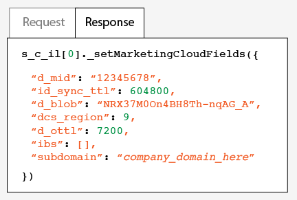

# Dynamic Tag Management를 사용하여 구현 {#implementation-with-dynamic-tag-management}

기존 구현은 DTM(Dynamic Tag Management)을 사용하여 Experience Cloud Identity 서비스를 설정 및 배포하고 다른 Experience Cloud 솔루션과 통합합니다.

## Dynamic Tag Management를 사용하여 구현 {#topic-6f4ed5d96977406ca991e50f3fbd5b01}

기존 구현은 DTM(Dynamic Tag Management)을 사용하여 Experience Cloud Identity 서비스를 설정 및 배포하고 다른 Experience Cloud 솔루션과 통합합니다.

>[!NOTE]
>
>Currently, [Adobe Experience Platform Launch](https://docs.adobelaunch.com/) is the preferred and recommended implementation tool because it helps simplify complex tag management tasks and automates code placement beyond the capabilities of DTM. [Launch를 사용한 구현](../implementation-guides/ecid-implement-with-launch.md)을 참조하십시오.

## Dynamic Tag Management 및 ID 서비스 {#section-4a4c4fac5d0a4cbbaff8e1833f73657c}

[다이내믹 태그 관리를](https://marketing.adobe.com/resources/help/en_US/dtm/) 사용하면 ID 서비스 인스턴스 및 관련 [!DNL Experience Cloud] 솔루션 통합을 구성, 배포 및 관리할 수 있습니다. DTM을 사용하면 ID 서비스 및 기타 Experience Cloud 솔루션과 긴밀하게 통합되므로 구현 프로세스를 간소화하는 데 도움이 됩니다. Experience Cloud ID 도구를 추가 및 구성한 후 다음과 같은 정보를 지정하면 됩니다.

* Experience Cloud 조직 ID(Experience Cloud에 연결된 경우 자동으로 채워짐)
* Analytics 추적 서버(보안 및 비보안)
* Experience Cloud 서버(퍼스트 파티 추적 서버)

DTM은 [!DNL Experience Cloud] 고객에게 무료로 제공됩니다.

**DTM 시작하기**

DTM은 단순하지만 강력한 도구입니다. 아직 사용해 본 적이 없다면 지금 사용해 보시기 바랍니다. DTM [설명서](https://marketing.adobe.com/resources/help/en_US/dtm/c_overview.html) 및 [DTM 빠른 시작(Jump Start) 비디오](https://marketing.adobe.com/resources/help/en_US/dtm/jump-start-videos.html)를 참조하여 이 서비스를 시작할 수 있습니다. DTM을 사용하여 ID 서비스를 설정하는 방법에 대한 지침은 아래 섹션에서 정보 및 절차를 참조하십시오.

## 배포 지침 {#concept-54a2ec49af8f4bfca9207b1d404e8e1a}

DTM(Dynamic Tag Management)을 사용하여 Experience Cloud Identity 서비스를 구현하기 전에 이러한 요구 사항과 절차를 검토하십시오.

<!--
mcvid-dtm-deployment.xml
-->

**계정 프로비저닝**

시작하기 전에, 조직과 솔루션에 [!DNL Experience Cloud]가 프로비저닝되어 있고 [!DNL Dyanamic Tag Management]에 대해 잘 알고 있는지 확인합니다. 이 설명서는 다음을 시작하는 데 도움이 됩니다.

* [핵심 서비스에](https://marketing.adobe.com/resources/help/en_US/mcloud/core_services.html)대한 솔루션 활성화:Experience Cloud를 구현하고 관리자가 됩니다. 이 프로세스는 고객 속성 및 Experience Cloud 대상과 같은 핵심 서비스에 대한 솔루션을 현대화합니다.
* [다이내믹 태그 관리 시작하기](https://marketing.adobe.com/resources/help/en_US/dtm/get_started.html)
* [이동 시작 비디오](https://marketing.adobe.com/resources/help/en_US/dtm/jump-start-videos.html):기본 DTM 작업을 수행하는 방법을 설명하는 짧은 비디오 시리즈입니다.

**ID 서비스 코드 배치 및 로드 순서**

ID 서비스는 [!DNL Adobe] 데이터 수집 서버에서 고유 ID를 요청 및 수신하여 작동합니다. 제대로 작동하려면 ID 서비스 코드가 다음과 같아야 합니다.

* 페이지에서 실행되는 [!DNL Adobe] 코드의 첫 번째 블록이어야 합니다.
* 가능한 한 페이지에서 높게 배치되며, 일반적으로 `<head>` 코드 블록 내에 있어야 합니다.

모든 [!DNL Adobe] 솔루션과 코드 라이브러리를 DTM에 유지하는 한 ID 서비스 코드가 올바른 위치에 배치되고 적시에 실행됩니다.

**지역 데이터 수집 유효성 검사**

Customers must provide a CNAME or use `*.sc.omtrdc` for [regional data collection](https://marketing.adobe.com/resources/help/en_US/whitepapers/rdc/) (RDC). [!DNL Adobe] 컨설턴트로부터 특정 RDC 설정을 확보합니다.

**Analytics 보고서 세트 구성**

새로운 [!DNL Analytics] 고객은 데이터 수집을 위해 [보고서 세트를 생성](https://marketing.adobe.com/resources/help/en_US/reference/new_report_suite.html)해야 합니다.

## DTM을 사용하여 Experience Cloud Identity 서비스 구현 {#task-a659cf19dea84ad48edabe0b72ef9f5c}

다음 단계에 따라 DTM(Dynamic Tag Management)을 사용하여 ID 서비스를 구현할 수 있습니다.

**전제 조건**

* [!DNL Experience Cloud]에 대해 솔루션을 활성화하고 관리자 권한을 보유하고 있는지 확인합니다. See [Enable your solutions for core services](https://marketing.adobe.com/resources/help/en_US/mcloud/core_services.html).

* DTM에서 웹 속성을 생성합니다. DTM [웹 속성 생성](https://marketing.adobe.com/resources/help/en_US/dtm/web_property.html) 설명서 또는 [관리자 빠른 시작(Admin Jump Start) 비디오](https://marketing.adobe.com/resources/help/en_US/dtm/admin-jump-start.html)를 참조하십시오.

<!--
mcvid-dtm-implement.xml
-->

**구현 단계** DTM을 사용하여 ID 서비스를 구현하는 방법:

1. DTM [!UICONTROL 대시보드]에서 작업하려는 웹 속성을 클릭합니다.
1. 선택한 웹 속성의 **[!UICONTROL 개요]** 탭에서 **[!UICONTROL 도구 추가]**&#x200B;를 클릭합니다.
1. **[!UICONTROL 도구 유형]** 목록에서 **[!UICONTROL Experience Cloud Identity 서비스]**&#x200B;를 클릭합니다.

   >[!NOTE]
   >
   >이 작업을 수행하면 **[!UICONTROL Experience Cloud 조직 ID]** 상자가 조직 ID로 채워집니다. DTM 계정이 [!DNL Experience Cloud]와 연결되지 않은 경우 해당 ID를 입력해야 합니다. 계정을 연결하려면 [Experience Cloud에서 계정 연결](https://marketing.adobe.com/resources/help/en_US/mcloud/organizations.html)을 참조하십시오. 조직 ID를 찾는 방법에 대한 자세한 내용은 [요구 사항](../reference/requirements.md#section-a02f537129a64ffbb690d5738d360c26)을 참조하십시오.

1. **[!UICONTROL 추적 서버]** 상자에 추적하는 서버의 이름을 입력합니다. If you're not sure how to find your tracking server see the [FAQ](../faq-intro/faq.md) and [Correctly Populate the trackingServer and trackingServerSecure variables](https://helpx.adobe.com/analytics/kb/determining-data-center.html#).
1. **[!UICONTROL 도구 생성]**, **[!UICONTROL 변경 내용 저장]**&#x200B;을 차례로 클릭합니다.

   저장하면 ID 서비스가 DTM에 도구로 설정됩니다. 하지만 아직 사용할 준비가 된 것은 아닙니다. DTM 도구는 여전히 DTM 게시/승인 프로세스를 거쳐야 하며, 추가 매개 변수를 구성해야 할 수도 있습니다. DTM 승인 프로세스에 대한 자세한 정보는 [사용자 기본사항 빠른 시작(User Basics Jump Start)](https://marketing.adobe.com/resources/help/en_US/dtm/user-basics-jump-start.html) 비디오를 참조하십시오. DTM에 추가할 수 있는 추가 매개 변수에 대한 자세한 내용은 [DTM에 대한 Experience Cloud Identity 서비스 설정](../implementation-guides/standard.md#concept-fb6cb6a0e6cc4f10b92371f8671f6b59)을 참조하십시오.

## DTM에 대한 Experience Cloud Identity 서비스 설정{#concept-fb6cb6a0e6cc4f10b92371f8671f6b59}

[!UICONTROL 조직 ID], [!UICONTROL 일반] 및 [!UICONTROL 고객 설정] 필드와 [!DNL Experience Cloud] ID 서비스에서 이러한 필드를 사용하는 방법에 대해 설명합니다.

<!--
mcvid-dtm-settings.xml
-->

## 이러한 설정을 찾는 방법 {#section-c5b2d1c928944ae2b8565c1b182fe575}

ID 서비스를 DTM(Dynamic Tag Management)에 도구로 추가 및 저장한 뒤에 설정을 사용할 수 있습니다. 또한 DTM 웹 속성의 [!UICONTROL 설치된 도구] 섹션에서 톱니바퀴 아이콘을 클릭하여 해당 설정에 액세스할 수도 있습니다.


## 조직 ID {#section-949b5a0d8af940558b04ff675cf53f77}

프로비저닝된 [!DNL Experience Cloud] 회사에서 요구하는 ID로, 해당 회사와 연결되어 있습니다. 조직은 관리자가 사용자와 그룹을 구성하고, [!DNL Experience Cloud]에서 단일 사인온 액세스를 제어할 수 있도록 해주는 엔티티입니다. 이 조직 ID는 24자의 영숫자 문자열과 @AdobeOrg(포함 필수)로 구성됩니다. [!DNL Experience Cloud] 관리자는 [Experience Cloud &gt; 도구](https://marketing.adobe.com/resources/help/en_US/mcloud/admin_getting_started.html)에서 이 ID를 찾을 수 있습니다.


[쿠키 및 Experience Cloud Identity 서비스](../introduction/cookies.md)도 참조하십시오.

## 일반 설정 {#section-071d358e40f84629a8901b893dd61392}

이러한 설정을 사용하여 추적 서버와 코드 버전을 지정하고 다른 변수를 추가할 수 있습니다.


다음 표에는 [!UICONTROL 일반] 설정이 나열 및 정의되어 있습니다.

**방문자 ID 자동 요청**

이 필드를 선택하면 Experience Cloud Identity 서비스를 사용하는 Adobe 솔루션을 로드하기 전에 Dynamic Tag Management에서 자동으로 `getMarketingCloudVisitorID()` 메서드를 호출하게 됩니다.

[getMarketingCloudVisitorID](../library/get-set/getmcvid.md)를 참조하십시오.

**Analytics 추적 서버**

Analytics 데이터 수집에 사용된 추적 서버 이름입니다. 이미지 요청 및 쿠키가 작성된 도메인입니다(예: `http://site.omtrdc.net`).

추적 서버 URL을 알 수 없는 경우 `s_code.js` 또는 `AppMeasurement.js` 파일을 확인하십시오. URL을 `s.trackingServer` 변수로 설정할 수 있습니다.

[ trackingServer](https://marketing.adobe.com/resources/help/en_US/sc/implement/trackingServer.html) 및 [trackingServer 및 trackingServerSecure 변수 올바로 채우기](https://helpx.adobe.com/analytics/kb/determining-data-center.html#)를 참조하십시오.

**보안 추적 서버**

Analytics 데이터 수집에 사용된 안전한 추적 서버 이름입니다. 이미지 요청 및 쿠키가 작성된 도메인입니다(예: `https://site.omtrdc.net`).

추적 서버 URL을 알 수 없는 경우 `s_code.js` 또는 `AppMeasurement.js` 파일을 확인하십시오. URL을 `s.trackingServerSecure` 변수로 설정할 수 있습니다.

[ trackingServer](https://marketing.adobe.com/resources/help/en_US/sc/implement/trackingServer.html) 및 [trackingServer 및 trackingServerSecure 변수 올바로 채우기](https://helpx.adobe.com/analytics/kb/determining-data-center.html#)를 참조하십시오.

**Experience Cloud 서버**

회사에서 퍼스트 파티 데이터 수집(CNAME)을 사용하여 서드 파티 컨텍스트에서 퍼스트 파티 쿠키를 사용하는 경우 여기에 추적 서버를 입력합니다(예: `http://metrics.company.com`).

**Experience Cloud 서버 보안**

회사에서 퍼스트 파티 데이터 수집(CNAME)을 사용하여 서드 파티 컨텍스트에서 퍼스트 파티 쿠키를 사용하는 경우 여기에 추적 서버를 입력합니다(예: `https://metrics.company.com`).

**라이브러리 버전**

사용하려는 ID 서비스 코드 라이브러리 버전(`VisitorAPI.js`)을 설정합니다. 이러한 메뉴 옵션은 수정할 수 없습니다.

**설정**

이러한 필드를 사용하면 [함수 변수](../library/function-vars/function-vars.md)를 키-값 쌍으로 추가할 수 있습니다. **[!UICONTROL 추가]를 클릭하여 한 개 이상의 변수를 ID 서비스 구현에 추가할 수 있습니다.**


>[!IMPORTANT]
>
>여기서 `cookieDomain` 변수를 설정합니다. 이 변수는 URL의 마지막 두 부분이 3자 이상인 다중 부분의 최상위 도메인에서 필수입니다. 위에 연결된 구성 변수 설명서를 참조하십시오.

## 고객 설정 {#section-238d1272c1504d148fe38fb0ae5d71c2}

통합 코드 또는 인증된 상태를 추가할 수 있는 추가 필드입니다.


**통합 코드**

통합 코드는 고객이 제공한 고유한 ID입니다. 통합 코드에는 에서 [데이터 소스를 생성](https://marketing.adobe.com/resources/help/en_US/aam/create-datasource.html)하기 위해 사용했던 값이 포함되어야 합니다[!DNL Audience Manager].

**값**

이 값은 사용자 ID를 포함한 데이터 요소여야 합니다. 데이터 요소는 클라이언트별 내부 시스템의 ID와 같이 동적 값에 적합한 컨테이너입니다.

**인증 상태**

인증 상태(예: 로그인함, 로그아웃함)에 따라 방문자를 정의하거나 식별하는 옵션입니다. [고객 ID 및 인증 상태](../reference/authenticated-state.md)를 참조하십시오.

## Experience Cloud Identity 서비스 테스트 및 확인 {#concept-644fdbef433b46ba9c0634ac95eaa680}

이러한 지침, 도구 및 절차를 통해 ID 서비스가 제대로 작동하는지 확인할 수 있습니다. 이러한 테스트는 일반적으로 ID 서비스에 적용되며, 다른 ID 서비스 및 [!DNL Experience Cloud] 솔루션 조합을 위한 것입니다.

<!--
mcvid-test-verify.xml
-->

## 시작하기 전에 {#section-b1e76ad552ed4eb793b6e521a55127d4}

ID 서비스 테스트 및 확인을 시작하기 위해 알고 있어야 할 중요한 정보입니다.

**브라우저 환경**

일반적인 브라우저 환경에서 테스트할 때는 테스트 전에 브라우저 캐시를 지웁니다.

익명 또는 시크릿 브라우저 세션에서 ID 서비스를 테스트할 수도 있습니다. 익명 세션에서는 각 테스트를 수행하기 전에 브라우저 쿠키 또는 캐시를 지울 필요가 없습니다.

**도구**

[ Adobe 디버거](https://marketing.adobe.com/resources/help/en_US/sc/implement/debugger.html) 및 [Charles HTTP 프록시](https://www.charlesproxy.com/)는 ID 서비스가 Analytics에서 제대로 작동하도록 구성되었는지 확인하는 데 도움이 됩니다. 이 섹션의 정보는 Adobe 디버거 및 Charles에서 반환한 결과를 기반으로 합니다. 하지만 가장 적합한 도구나 디버거를 자유롭게 사용할 수 있습니다.

## Adobe 디버거로 테스트하기 {#section-861365abc24b498e925b3837ea81d469}

[!DNL Adobe] 디버거 응답에 [!DNL Experience Cloud ID] (MID)가 표시되면 서비스 통합이 제대로 구성된 것입니다. MID에 대한 자세한 내용은 [쿠키 및 Experience Cloud Identity 서비스](../introduction/cookies.md)를 참조하십시오.

[!DNL Adobe] 디버거를 [](https://marketing.adobe.com/resources/help/en_US/sc/implement/debugger.html)사용하여 ID 서비스의 상태를 확인하려면:

1. 브라우저 쿠키를 지우거나 익명의 브라우저 세션을 엽니다.
1. ID 서비스 코드가 포함된 테스트 페이지를 로드합니다.
1. [!DNL Adobe] 디버거를 엽니다.
1. MID 결과를 확인합니다.

## Adobe 디버거 결과 이해하기 {#section-bd2caa6643d54d41a476d747b41e7e25}

MID는 이 `MID= *`Experience Cloud ID`*` 구문을 사용하는 키-값 쌍에 저장됩니다. 디버거는 이 정보를 다음과 같이 표시합니다.

**성공**

다음과 유사한 응답이 표시되면 ID 서비스가 제대로 구현된 것입니다.

```
mid=20265673158980419722735089753036633573
```

[!DNL Analytics] 고객인 경우 MID 외에 AID([!DNL Analytics] ID)가 표시될 수 있습니다. 다음과 같은 경우 발생합니다.

* 초기/장기 사이트 방문자가 있는 경우
* 유예 기간을 활성화한 경우

**실패**

디버거가 다음과 같은 경우 [고객 지원 센터](https://helpx.adobe.com/marketing-cloud/contact-support.html)에 문의하십시오.

* MID를 반환하지 않는 경우
* 파트너 ID가 프로비저닝되지 않았다는 오류 메시지가 반환되는 경우

## Charles HTTP 프록시로 테스트하기 {#section-d9e91f24984146b2b527fe059d7c9355}

Charles에서 ID 서비스 상태를 확인하려면

1. 브라우저 쿠키를 지우거나 익명의 브라우저 세션을 엽니다.
1. Charles를 시작합니다.
1. ID 서비스 코드가 포함된 테스트 페이지를 로드합니다.
1. 요청 및 응답 호출과 아래에 설명된 데이터를 확인합니다.

## Charles 결과 이해하기 {#section-c10c3dc0bb9945cbaffcf6fec7082fab}

Charles를 사용하여 HTTP 호출을 모니터링할 때 살펴볼 위치와 찾을 내용, 사용할 시기에 대한 정보는 이 섹션을 참조하십시오.

### Charles의 성공적인 ID 서비스 요청

`Visitor.getInstance` 함수가 `dpm.demdex.net`에 JavaScript 호출을 수행하면 ID 서비스 코드가 제대로 작동하는 것입니다. 성공적인 요청에는 [조직 ID](../reference/requirements.md#section-a02f537129a64ffbb690d5738d360c26)가 포함되어 있습니다. 조직 ID는 `d_orgid= *`organization ID`*` 구문을 사용하는 키-값 쌍으로 전달됩니다. `dpm.demdex.net`구조[!UICONTROL  탭에서 ] 및 JavaScript 호출을 찾습니다. [!UICONTROL 요청] 탭에서 조직 ID를 찾습니다.


### Charles의 성공적인 ID 서비스 응답

[DCS(데이터 수집 서버)](https://marketing.adobe.com/resources/help/en_US/aam/c_compcollect.html)의 응답에서 MID를 반환하면 계정이 ID 서비스에 대해 제대로 프로비저닝된 것입니다. MID는 `d_mid: visitor Experience Cloud ID` 구문을 사용하는 키-값 쌍으로 반환됩니다. 아래 표시된 것처럼 [!UICONTROL 응답] 탭에서 MID를 찾습니다.



### Charles의 ID 서비스 응답 실패

DCS 응답에서 MID가 누락된 경우 계정이 제대로 프로비저닝되지 않은 것입니다. 실패한 응답은 아래 표시된 것처럼 [!UICONTROL 응답] 탭에 오류 코드와 메시지를 반환합니다. DCS 응답에서 이 오류 메시지가 표시되면 고객 지원 센터에 문의하십시오.


오류 코드에 대한 자세한 정보는 [DCS 오류 코드, 메시지 및 예제](https://marketing.adobe.com/resources/help/en_US/aam/dcs_error_codes.html)를 참조하십시오.

>[!MORELIKETHIS]
>
>* [웹 속성](https://marketing.adobe.com/resources/help/en_US/dtm/web_property.html)

