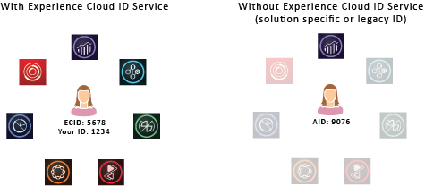

# 방문자 ID 서비스 정보{#aboutidservice}

Adobe CX Enterprise에서 방문자 ID 서비스의 역할입니다.

<!--
mcvid-functionality.xml
-->

## 방문자 ID 서비스: 핵심 서비스의 기본 요소 {#section-2de0eb1d65664e92a4d8bbb167b84bde}

방문자 ID 서비스를 통해 CX 엔터프라이즈 핵심 서비스, 솔루션, 고객 속성 및 대상에 공통된 ID 프레임워크를 사용할 수 있습니다. 영구적인 고유 ID를 사이트 방문자에게 할당하여 작동합니다. 조직에서 방문자 ID 서비스를 구현하면 이 ID를 사용하여 다른 CX 엔터프라이즈 솔루션에서 동일한 사이트 방문자와 해당 데이터를 식별할 수 있습니다.

또한 방문자 ID 서비스는 다른 솔루션별 ID(예: Analytics AID)를 대체할 수 있습니다. 그리고 [고객 ID 및 인증 상태](../reference/authenticated-state.md) 기능을 통해 방문자 ID 서비스를 사용하면 자신의 고객 ID를 CX Enterprise에 전달할 수 있습니다. 그러나 방문자 ID 서비스는 이미 구독한 솔루션에서만 작동한다는 점을 잊지 마십시오. 등록하지 않은 경우 다른 제품에 대한 액세스를 제공하지 않습니다.

앞으로 방문자 ID 서비스는 현재 및 미래의 수 많은 CX 엔터프라이즈 기능, 개선 사항 및 서비스의 필수 구성 요소입니다. 현재 방문자 ID 서비스는 [Analytics](http://www.adobe.com/kr/marketing-cloud/web-analytics.html), [Audience Manager](http://www.adobe.com/kr/marketing-cloud/data-management-platform.html) 및 [Target](http://www.adobe.com/kr/marketing-cloud/testing-targeting.html)을 지원합니다. Adobe Device Co-op에 참여하려는 경우에도 ID 서비스가 필요합니다. 방문자 ID 서비스를 구현하지 않았다면 지금이 바로 마이그레이션 전략을 시작할 적기입니다.

## 기능 요약 {#section-96555473455c4bf8924c2d56ff4f3255}

방문자 ID 서비스를 요약하면 다음과 같습니다.

* 프로필과 ID를 연결하는 데 사용할 수 있는 일반 키 또는 ID를 만듭니다.
* 여러 솔루션에서 디바이스를 고유하게 식별합니다.
* 동일한 도메인에서 추적할 수 있도록 고객 도메인에 자사 쿠키를 설정합니다. [쿠키 및 방문자 ID 서비스](../introduction/cookies.md)를 참조하십시오.
* CX 엔터프라이즈 고객 및 파트너로부터 별칭 및 ID 매핑을 받습니다.
* CX Enterprise 내에서 ID 동기화를 관리합니다.
* 광고 기술 에코 시스템에서 다른 서드파티와 ID 동기화를 지원합니다.

