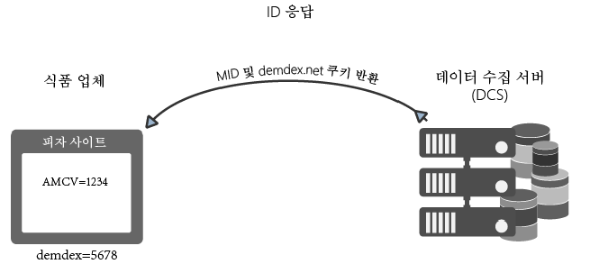
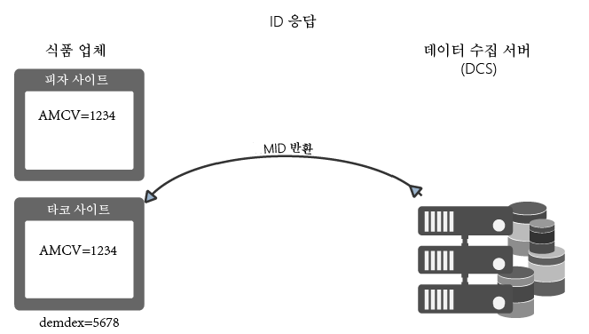

# Experience Cloud Identity Service에서 ID를 요청하고 설정하는 방법{#how-the-experience-cloud-id-service-requests-and-sets-ids}

ID 요청 및 응답 프로세스에 대한 개요입니다. 이러한 예제에서는 개별 사이트, 여러 다른 사이트 및 자체 조직 ID가 있는 다른 Experience Cloud 고객이 관리하는 사이트에 대한 ID 지정을 다룹니다.

>[!NOTE]
>
>Experience Cloud Identity Service에서 방문자 ID를 만드는 방법을 잘 모를 경우 잠시 [Experience Cloud](../introduction/cookies.md)를 검토하십시오.

## Experience Cloud ID 요청 {#section-0b5e261fbd0547d9b9a1680e5ce536cc}

다음 예제에서는 ID 서비스에서 Experience Cloud 방문자 ID를 요청하고 수신하는 방법을 보여 줍니다. 이러한 예제에서는 2개의 가상 회사인 Food Company와 Sports Company를 사용하여 ID 요청 및 응답에 대한 데이터 흐름을 보여 줍니다. 각 회사는 고유한 Experience Cloud 조직 ID를 가지며 모든 사이트에 ID 서비스 코드를 구현했습니다. 이러한 사용 사례에서는 Analytics, 이전 ID 또는 서드파티 쿠키를 차단하는 브라우저가 없는 일반적인 ID 서비스에 대한 데이터 흐름을 나타냅니다.

**첫 번째 요청**

이 예에서는 Food Company에서 관리하는 피자 사이트에 신규 방문자가 방문합니다. Food Company는 피자 웹 사이트에 ID 서비스 코드가 있습니다. 피자 사이트가 로드되면 ID 서비스 코드는 피자 도메인에서 AMCV 쿠키를 확인합니다.

* AMCV 쿠키가 설정된 경우 사이트 방문자는 Experience Cloud ID를 갖습니다. 이 경우 쿠키는 방문자를 추적하고 다른 Experience Cloud 솔루션과 데이터를 공유합니다.
* AMCV 쿠키가 설정되지 않은 경우 ID 서비스 코드가 `dpm.demdex.net/id`에서 지역 [데이터 수집 서버](https://experienceleague.adobe.com/docs/analytics/technotes/rdc/regional-data-collection.html?lang=ko-KR)(DCS)를 호출합니다([Demdex 도메인에 대한 호출 이해](https://experienceleague.adobe.com/docs/audience-manager/user-guide/reference/demdex-calls.html?lang=ko-KR) 참조). 이 호출에는 Food Company에 대한 조직 ID가 포함됩니다. 조직 ID는 ID 서비스 코드의 `Visitor.getInstance` 함수에 설정됩니다.

**첫 번째 응답**

응답에서 DCS는 [!DNL Experience Cloud] ID(MID) 및 demdex 쿠키를 반환합니다. ID 서비스 코드는 MID 값을 AMCV 쿠키에 씁니다. 예를 들어 DCS가 1234의 MID 값을 반환한다고 가정해 보겠습니다. AMCV 쿠키가 `mid|1234`로 저장되고 자사의 피자 도메인에 설정됩니다. demdex 쿠키에도 고유한 ID(예: 5678)가 포함되어 있습니다. 이 쿠키는 피자 도메인과 별개인 서드파티 demdex.net 도메인에 설정됩니다.

다음 예와 같이, 방문자가 Food Company에 속하는 다른 사이트로 이동할 때 ID 서비스는 demdex ID 및 조직 ID를 사용하여 올바른 MID를 생성 및 반환할 수 있습니다.

## 사이트 간 요청 및 응답 {#section-15ea880453af467abd2874b8b4ed6ee9}

이 예에서는 Food Company 방문자가 피자 사이트에서 타코 사이트로 이동합니다. Food Company는 타코 웹 사이트에 ID 서비스 코드가 있습니다. 방문자는 타코 웹 사이트에 가본 적이 없습니다.

이 경우, 타코 사이트에는 AMCV 쿠키가 없습니다. 또한 ID 서비스는 피자 도메인에만 해당되므로 피자 사이트에 설정된 AMCV 쿠키를 사용할 수 없습니다. 따라서 ID 서비스는 DCS를 호출하여 방문자 ID를 확인 및 요청해야 합니다. 이 경우 DCS 호출에는 Food Company의 조직 ID *및* demdex ID가 포함됩니다. 그리고 기억할 사항으로, demdex ID는 피자 사이트에서 선택된 후 demdex.net 도메인 아래에 서드파티 쿠키로 저장됩니다.

DCS가 조직 ID와 demdex ID를 수신하면 사이트 방문자에 대한 정확한 MID가 생성되어 반환됩니다. MID는 조직 ID 및 demdex ID에서 수학적으로 파생되므로 AMCV 쿠키에 값 `mid = 1234`mid = 가 포함됩니다.

## 다른 사이트의 ID 요청 {#section-ba9a929e50d64b0aba080630fd83b6f1}

이 예에서는 방문자가 Food Company 사이트를 떠나 Sports Company가 소유한 축구 사이트로 이동합니다. 방문자가 축구 사이트를 방문하면 ID 확인 및 요청 프로세스가 이전 예제에 설명된 것과 동일한 방식으로 작동합니다. 하지만 Sports Company의 자체 조직 ID가 있으므로 ID 서비스는 다른 MID를 반환합니다. 새 MID는 Sports Company에서 제어하는 도메인에 고유하며, 해당 기업이 [!DNL Experience Cloud]에서 솔루션 간에 방문자 데이터를 추적하고 공유할 수 있게 해 줍니다. demdex ID는 서드파티 쿠키에 포함되고 도메인이 달라져도 그대로 유지되므로 이 방문자에 대해 동일하게 유지됩니다.

