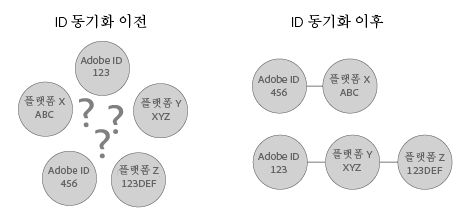

# ID 동기화 및 일치율 이해하기{#understanding-id-synchronization-and-match-rates}

Adobe Media Optimizer 및 ID 서비스를 비롯한 Experience Cloud Identity 서비스의 ID 동기화 프로세스 및 일치율에 대한 개요입니다.

## ID 동기화 및 일치율 {#section-f652aae7234945e89d26dd833c5215fb}

ID 동기화는 ID 서비스가 할당한 ID와 고객이 사이트 방문자에게 할당한 ID를 일치시킵니다. 예를 들어, ID 서비스가 방문자에게 ID 1234를 할당했다고 가정해 보겠습니다. 다른 플랫폼에서는 이 방문자를 ID 4321로 알고 있습니다. ID 서비스는 동기화 프로세스 동안 이러한 ID를 함께 매핑합니다. 그 결과 고객이 사이트 방문자에 대해 알고 있는 새로운 데이터 지점이 추가됩니다. 또한, ID 서비스가 ID를 일치시킬 수 없는 경우 새 ID를 생성하고 나중에 동기화할 때 해당 ID를 사용합니다.

일치 비율은 ID 동기화 프로세스의 효과를 측정하고 검증합니다. 높은 일치 비율은 특정 서비스가 보다 효과적이며 낮은 일치 비율의 서비스보다 온라인 고객에게 더 많은 액세스를 제공함을 나타냅니다. 일치 비율 비교는 다양한 통합 광고 기술 플랫폼을 평가할 수 있는 수량적 방법입니다.

**높은 일치율 보장**

높은 일치율을 만들려면 ID 서비스를 제대로 설정하는 것이 중요합니다([표준 구현 가이드](../implementation-guides/standard.md#concept-89cd0199a9634fc48644f2d61e3d2445) 참조). 적절한 구현은 ID 서비스가 ID가 작동하고 활성화된 데이터 파트너와 동기화하는 데 필요한 쿠키를 설정할 수 있기 때문에 높은 일치 속도를 보장하는 데 도움이 됩니다. 하지만 느린 인터넷 연결, 모바일 장치 또는 무선 네트워크에서 데이터 수집 등과 같은 요소는 ID 서비스가 ID를 얼마나 잘 수집, 동기화 및 일치하는지에 영향을 줄 수 있습니다. 이러한 클라이언트측 변수는 ID 서비스나 [!DNL Adobe]의 제어 범위를 벗어납니다.

## ID 동기화 프로세스 설명 {#section-a541a85cbbc74f5682824b1a2ee2a657}

ID 서비스는 실시간으로 ID를 동기화합니다. 이 프로세스는 서버 간 데이터 전송을 통해서가 아니라 브라우저에서 작동합니다. 다음 표는 ID 동기화 프로세스의 단계를 설명합니다.

**1단계: 페이지 로드**

방문자가 사이트에 방문하여 페이지를 로드하면 `Visitor.getInstance` 함수는 ID 서비스에 대해 [CORS](../reference/cors.md#concept-6c280446990d46d88ba9da15d2dcc758) 또는 JSON-P를 호출합니다. ID 서비스는 방문자의 [!DNL Experience Cloud] ID(MID)를 포함하는 쿠키에 응답합니다. MID는 각 사이트 방문자에게 할당된 고유 ID입니다. [쿠키 및 Experience Cloud Identity 서비스](../introduction/cookies.md)도 참조하십시오.

**2단계: iFrame 로드**

페이지 본문을 로드하는 동안 ID 서비스는 *`Destination Publishing iFrame`*&#x200B;라는 iFrame을 로드합니다. [!UICONTROL 대상 게시 iFrame]은 상위 페이지와 별도로 도메인에서 로드됩니다. 이러한 설계는 iFrame을 사용하여 페이지 성능을 보장하고 보안을 개선하는 데 도움이 됩니다.

* 상위 페이지를 기준으로 비동기식으로 로드합니다. 즉, 상위 페이지는 [!UICONTROL 대상 게시 iFrame]과 별도로 로드될 수 있습니다. iFrame을 로드하고  iFrame 내에서 ID 동기화 픽셀을 로드해도 상위 페이지나 사용자 경험에 영향을 주지 않습니다.
* 가능한 빠르게 로드합니다. 너무 빠르게 로드되는 경우, 창 로드 이벤트 후에 iFrame리 로드될 수 있습니다(권장되지 않음). 자세한 정보는 [idSyncAttachIframeOnWindowLoad](../library/function-vars/idsyncattachiframeonwindowload.md#reference-b86b7112e0814a4c82c4e24c158508f4)를 참조하십시오.
* iFrame의 코드가 상위 페이지에 액세스하거나 영향을 받지 않도록 합니다.

또한, [Experience Cloud Identity 서비스에서 ID를 요청하고 설정하는 방법...](../introduction/id-request.md#concept-2caacebb1d244402816760e9b8bcef6a)도 참조하십시오.

**3단계: Fire ID 동기화**

ID 동기화는 대상 게시 iFrame에서 실행되는 URL입니다. 이 일반적인 예제에서 알 수 있듯이 ID 동기화 URL에는 파트너의 ID 동기화 종단점 및 ID를 포함하여 [!DNL Adobe]로 리디렉션되는 리디렉션 URL이 포함되어 있습니다.

`http://abc.com?partner_id=abc&sync_id=123&redir=http://dpm.demdex.net/ibs:dpid=<ADOBE_PARTNER_ID>&dpuuid=<PARTNER_UUID>`

또한 [인바운드 데이터 전송을 위한 ID 동기화](https://docs.adobe.com/content/help/ko-KR/audience-manager/user-guide/implementation-integration-guides/sending-audience-data/batch-data-transfer-process/id-sync-http.html)를 참조하십시오.

**4단계: ID 저장**

동기화된 ID는 [에지 및 핵심 데이터 서버](https://docs.adobe.com/content/help/ko-KR/audience-manager/user-guide/reference/system-components/components-edge.html)에 저장됩니다.

## 동기화 서비스에서 ID 동기화 관리 {#section-cd5784d7ad404a24aa28ad4816a0119a}

*`Sync Services`* 용어는 ID 동기화를 담당하는 내부 [!DNL Experience Cloud] 기술을 말합니다. 이 서비스는 기본적으로 활성화되어 있습니다. 비활성화하려면 [선택적 변수](../library/function-vars/disableidsync.md#reference-589d6b489ac64eddb5a7ff758945e414)를 ID 서비스 `Visitor.getInstance` 함수에 추가합니다. 동기화 서비스는 다음과 같은 서로 다른 [!DNL Experience Cloud] ID를 일치시킵니다.

* 타사 [!DNL Experience Cloud] 쿠키 ID와 사타 [!DNL Experience Cloud] ID.

* 자사 [!DNL Experience Cloud] 쿠키 ID와 [!DNL Adobe Media Optimizer] (AMO) ID.

* 서드파티 [!DNL Experience Cloud] 쿠키 ID와 서드파티 데이터 제공업체 및 타깃팅 플랫폼 ID. 데이터 제공업체, 수요측 및/또는 공급측 플랫폼, 광고 네트워크, 교환 등과 같은 서비스 및 플랫폼이 이에 해당합니다.
* 자사 [!DNL Experience Cloud] 쿠키 ID와 장치 간 파트너 ID.

## Adobe Advertising Cloud를 사용한 ID 동기화 {#section-642c885ea65d45ffb761f78838735016}

[!DNL Adobe Advertising Cloud] (이전에 호출된 [!DNL Adobe Media Optimizer])는 iFrame 기반 ID 동기화 프로세스의 예외입니다. [!DNL Advertising Cloud]는 신뢰할 수 있는 도메인이므로 [!UICONTROL 대상 게시 iFrame]보다 상위 페이지에서 ID 동기화가 발생합니다. 동기화 중에 ID 서비스는 `cm.eversttech.net`에서 [!DNL Advertising Cloud]를 호출합니다. cm.eversttech.net은 Adobe에서 획득하기 전에 [!DNL Advertising Cloud]에 사용된 기존 도메인 이름입니다. 데이터를 [!DNL Advertising Cloud]로 보내면 일치율이 향상되고, 버전 2.0 이상을 사용하는 ID 서비스 고객의 경우 자동으로 사용됩니다. 또한, [Advertising Cloud 쿠키](https://docs.adobe.com/content/help/ko-KR/core-services/interface/ec-cookies/cookies-advertising-cloud.html)도 참조하십시오.

>[!MORELIKETHIS]
>
>* [Demdex 도메인에 대한 호출 이해](https://docs.adobe.com/content/help/ko-KR/audience-manager/user-guide/reference/demdex-calls.html)

