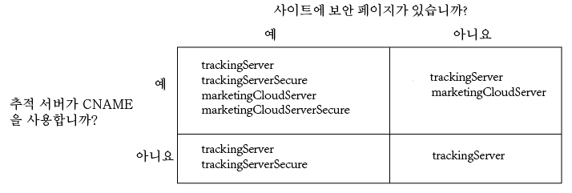

# Analytics용 Experience Cloud ID 서비스 구현 {#implement-the-experience-cloud-id-service-for-analytics}

이러한 지침은 Experience Cloud ID 서비스를 사용하고 DTM(다이내믹 태그 관리)은 사용하지 않으려는 Analytics 고객을 대상으로 합니다. 하지만 ID 서비스를 구현하려면 DTM을 사용하는 것이 좋습니다. DTM은 구현 작업 과정을 간소하게 하고 올바른 코드 배치 및 시퀀스를 자동으로 보장합니다.

>[!IMPORTANT]
>
>* [시작하기 전에 요구 사항을 읽어보십시오](../mcvid-reference/mcvid-requirements.md).
>* 프로덕션 환경에서 구현하기 전에 개발 환경에서 이 코드를 구성하고 테스트하십시오.
>


다음 단계에 따라 Adobe Analytics에 대한 ID 서비스를 구현하십시오.

1. [ID 서비스 코드 다운로드](../mcvid-implementation-guides/mcvid-setup-analytics.md#section-ead9403a6b7e45b887f9ac959ef89f7f)
1. [Visitor. getinstance 함수를 ID 서비스 코드에 추가](../mcvid-implementation-guides/mcvid-setup-analytics.md#section-6053a6b7c16c466a9f9fdbf9cb9db3df)
1. [Experience Cloud 조직 ID를 Visitor. getinstance에 추가](../mcvid-implementation-guides/mcvid-setup-analytics.md#section-7b8a6e76dc124d0e9ab1ce96ab2ffb0e)
1. [Visitor. getinstance에 추적 서버 추가](../mcvid-implementation-guides/mcvid-setup-analytics.md#section-70ec9ebff47940d8ab520be5ec4728c5)
1. [Appmeasurement. js 또는 s_ code. js 파일 업데이트](../mcvid-implementation-guides/mcvid-setup-analytics.md#section-b53113aea1bd4de896e0e4e9a7edee19)
1. [페이지에 방문자 API 코드 추가](../mcvid-implementation-guides/mcvid-setup-analytics.md#section-d46d6aa324c842f2931d901e38d6db1d)
1. [(선택 사항) 유예 기간 구성](../mcvid-implementation-guides/mcvid-setup-analytics.md#section-7bbb2f72c26e4abeb8881e18366797a3)
1. [ID 서비스 코드 테스트 및 배포](../mcvid-implementation-guides/mcvid-setup-analytics.md#section-e9c1764ac21a4ec5be1ff338c0e2e01b)

## 1 단계: ID 서비스 코드 다운로드 {#section-ead9403a6b7e45b887f9ac959ef89f7f}

코드 라이브러리가 [!DNL ID Service]`VisitorAPI.js` 필요합니다. 이 코드 라이브러리를 다운로드하려면

1. **[!UICONTROL 관리]** &gt; **[!UICONTROL 코드 관리자로 이동합니다]**.
1. 에서 [!DNL Code Manager]**[!UICONTROL JavaScript (신규)]** 또는 **[!UICONTROL JavaScript (기존) 를 클릭합니다]**.

   이렇게 하면 압축된 코드 라이브러리가 다운로드됩니다.

1. 코드 파일의 압축을 풀고 `VisitorAPI.js` 파일을 엽니다.

## 2단계. Visitor. getinstance 함수를 ID 서비스 코드에 추가 {#section-6053a6b7c16c466a9f9fdbf9cb9db3df}

>[!IMPORTANT]
>
>* 이전 버전의 ID 서비스 API에서는 이 함수가 다른 위치에 있으므로 다른 구문이 필요합니다. [버전 1.4](../mcvid-release-notes/mcvid-notes-2015.md#section-f5c596f355b14da28f45c798df513572) 이전 버전에서 마이그레이션하는 경우에는 여기에 설명된 새 위치 및 구문을 확인하십시오.
>* 모두 대문자로 된 코드는 실제 값의 자리 표시자입니다. 이 텍스트를 조직 ID, 추적 서버 URL 또는 이름이 지정된 기타 값으로 바꿉니다.
>


**1부: 아래의 Visitor.getInstance 함수 복사**

```js
var visitor = Visitor.getInstance("INSERT-MARKETING-CLOUD-ORGANIZATION-ID-HERE", { 
     trackingServer: "INSERT-TRACKING-SERVER-HERE", // same as s.trackingServer 
     trackingServerSecure: "INSERT-SECURE-TRACKING-SERVER-HERE", // same as s.trackingServerSecure 
 
     // To enable CNAME support, add the following configuration variables 
     // If you are not using CNAME, DO NOT include these variables 
     marketingCloudServer: "INSERT-TRACKING-SERVER-HERE", 
     marketingCloudServerSecure: "INSERT-SECURE-TRACKING-SERVER-HERE" // same as s.trackingServerSecure 
}); 
```

**2부: 함수 코드를 VisitorAPI.js 파일에 추가**

`Visitor.getInstance` 함수를 파일 끝, 코드 블록 뒤에 추가합니다. 편집한 파일은 다음과 같습니다.

```js
/* 
========== DO NOT ALTER ANYTHING BELOW THIS LINE ========== 
Version and copyright section 
*/ 
 
// Visitor API code library section 
 
// Put Visitor.getInstance at the end of the file, after the code library

var visitor = Visitor.getInstance("INSERT-MARKETING-CLOUD-ORGANIZATION-ID-HERE", { 
     trackingServer: "INSERT-TRACKING-SERVER-HERE", // same as s.trackingServer 
     trackingServerSecure: "INSERT-SECURE-TRACKING-SERVER-HERE", // same as s.trackingServerSecure 
 
     // To enable CNAME support, add the following configuration variables 
     // If you are not using CNAME, DO NOT include these variables 
     marketingCloudServer: "INSERT-TRACKING-SERVER-HERE", 
     marketingCloudServerSecure: "INSERT-SECURE-TRACKING-SERVER-HERE" // same as s.trackingServerSecure 
}); 
```

## 3 단계: Experience Cloud 조직 ID를 Visitor. getinstance에 추가 {#section-7b8a6e76dc124d0e9ab1ce96ab2ffb0e}

`Visitor.getInstance` 함수에서 조직 ID `INSERT-MARKETING-CLOUD-ORGANIZATION ID-HERE` 로 [!DNL Experience Cloud] 대체합니다. 조직 ID를 모를 경우 [!DNL Experience Cloud] 관리 페이지에서 찾을 수 있습니다. [관리 - 핵심 서비스](https://marketing.adobe.com/resources/help/en_US/mcloud/admin_getting_started.html)도 참조하십시오. 편집한 함수는 아래 예제와 비슷합니다.

`var visitor = Visitor.getInstance("1234567ABC@AdobeOrg", { ...`

>[!IMPORTANT]
>
>*조직 ID에서 문자의 대소문자를* 변경하지 마십시오. ID는 대/소문자를 구분하므로 제공된 그대로 정확히 사용해야 합니다.

## 4 단계: Visitor. getinstance에 추적 서버 추가 {#section-70ec9ebff47940d8ab520be5ec4728c5}

추적 서버는 [!DNL Analytics] 데이터 수집에 사용됩니다.

**1부: 추적 서버 URL 찾기**

`s_code.js` 또는 `AppMeasurement.js` 파일을 확인하여 추적 서버 URL를 찾습니다. URL을 다음 변수로 지정할 수 있습니다.

* `s.trackingServer`
* `s.trackingServerSecure`

**2부: 추적 서버 변수 설정**

사용할 추적 서버 변수를 확인하려면

1. 아래의 의사 결정 매트릭스에 제시된 질문에 답변합니다. 답변에 해당하는 변수를 사용합니다.
1. 추적 서버 자리 표시자를 추적 서버 URL로 바꿉니다.
1. 사용하지 않은 추적 서버 및 [!DNL Experience Cloud] 서버 변수를 코드에서 제거합니다.



>[!NOTE]
>
>사용하는 경우 [!DNL Experience Cloud] 다음과 같이 해당 추적 서버 URL에 서버 URL를 일치시킵니다. &gt;
>* [!DNL Experience Cloud] 서버 URL = 추적 서버 URL
>* [!DNL Experience Cloud] 서버 보안 URL = 추적 서버 보안 URL
>


추적 서버를 찾는 방법을 모를 경우 [FAQ를](../mcvid-faq-intro/mcvid-faq.md) 참조하고 [trackingserver 및 trackingserversecure 변수를 올바로](https://helpx.adobe.com/analytics/kb/determining-data-center.html#)채우십시오.

## 5 단계: Appmeasurement. js 또는 s_ code. js 파일 업데이트 {#section-b53113aea1bd4de896e0e4e9a7edee19}

이 함수를 `AppMeasurement.js` 또는 `s_code.js` 파일에 추가합니다.

`s.visitor = Visitor.getInstance("INSERT-MARKETING-CLOUD-ORGANIZATION ID-HERE");`

`linkInternalFilters`, `charSet``trackDownloads`등과 같은 구성을 포함하는 동일한 섹션에 코드를 배치합니다.

***(선택 사항이지만 권장됨)*사용자 지정 Prop 만들기**

사용자 지정 prop를 `AppMeasurement.js` 설정하거나 `s_code.js` 범위를 측정하십시오. 사용자 지정 prop를 `doPlugins``AppMeasurement.js` 사용자 또는 `s_code.js` 파일의 함수에 추가합니다.

```js
// prop1 is used as an example only. Choose any available prop. 
s.prop1 = (typeof(Visitor) != "undefined" ? "VisitorAPI Present" : "VisitorAPI Missing");
```

## 6 단계: 페이지에 방문자 API 코드 추가 {#section-d46d6aa324c842f2931d901e38d6db1d}

각 페이지의 `VisitorAPI.js``<head>` 태그 내에 파일을 배치합니다. `VisitorAPI.js` 파일을 페이지에 넣을 경우:

* `<head>` 섹션 맨 앞에 배치하면 다른 솔루션 태그 앞에 표시됩니다.
* AppMeasurement 및 다른 [!DNL Experience Cloud] 솔루션에 대한 코드 앞에서 실행해야 합니다.

테스트 및 확인 후에 이 코드를 프로덕션으로 이동합니다.

## 7 단계: (선택 사항) 유예 기간 구성 {#section-7bbb2f72c26e4abeb8881e18366797a3}

이러한 사용 사례가 사용자의 상황에 적용되는 경우에는 [고객 지원 센터에](https://helpx.adobe.com/marketing-cloud/contact-support.html) 임시 [유예 기간을 설정하도록 요청하십시오](../mcvid-reference/mcvid-analytics-reference/mcvid-grace-period.md). 유예 기간은 최대 180일 동안 실행할 수 있습니다. 필요한 경우 유예 기간을 갱신할 수 있습니다.

**부분적인 구현**

ID 서비스를 사용하는 페이지도 있고 그렇지 않은 페이지도 있으며 이러한 모든 페이지가 동일한 [!DNL Analytics] 보고서 세트로 보고하는 경우에 유예 기간이 필요합니다. 이러한 상황은 여러 도메인 간에 보고를 수행하는 전역 보고서 세트가 있는 경우에 일반적입니다.

ID 서비스가 동일한 보고서 세트에 보고하는 모든 웹 페이지에 배포된 후에 유예 기간을 중단하십시오.

**s_vi Cookie 요구 사항**

ID 서비스로 마이그레이션한 후에 새 방문자가 s_vi 쿠키를 보유해야 하는 경우 유예 기간이 필요합니다. 이러한 상황은 구현에 s_vi 쿠키가 필요하고 이러한 쿠키가 변수에 저장되는 경우에 일반적입니다.

구현이 s_vi 쿠키를 읽는 대신 MID를 캡처할 수 있게 되면 유예 기간을 중단하십시오.

자세한 내용은 [쿠키 및 ExExperience Cloud ID 서비스](../mcvid-introduction/mcvid-cookies.md).

클릭스트림 데이터 피드에서 내부 시스템으로 데이터를 보내고 해당 프로세스에서 `visid_high` 및 `visid_low` 열이 사용되는 경우에 유예 기간이 필요합니다.

데이터 처리 프로세스에서 `post_visid_high` 및 `post_visid_low` 열을 사용할 수 있게 되면 유예 기간을 중지합니다.

[클릭스트림 데이터 열 참조](https://marketing.adobe.com/resources/help/en_US/sc/clickstream/datafeeds_reference.html)을 참조하십시오.

**클릭스트림 데이터 처리**

## 8 단계: ID 서비스 코드 테스트 및 배포 {#section-e9c1764ac21a4ec5be1ff338c0e2e01b}

다음과 같이 테스트하고 배포할 수 있습니다.

**테스트 및 확인**

ID 서비스 구현을 테스트하려면 다음을 확인하십시오.

* 페이지가 호스팅된 도메인의 [AMCV 쿠키](../mcvid-introduction/mcvid-cookies.md)
* [!DNL Analytics]Adobe 디버거 도구[를 사용한 ](https://marketing.adobe.com/resources/help/en_US/sc/implement/debugger.html) 이미지 요청의 MID 값

Experience Cloud ID 서비스를 [테스트하고 확인합니다](../mcvid-implementation-guides/mcvid-test-verify.md).

**코드 배포**

테스트를 통과한 후에 코드를 배포하십시오.

[7단계](../mcvid-implementation-guides/mcvid-setup-analytics.md#section-7bbb2f72c26e4abeb8881e18366797a3)에서 유예 기간을 사용하도록 설정한 경우

* 이미지 요청에 AID([!DNL Analytics] ID) 및 MID가 있는지 확인합니다.
* 중단 기준을 충족한 경우 유예 기간을 사용하지 않도록 설정하십시오.
