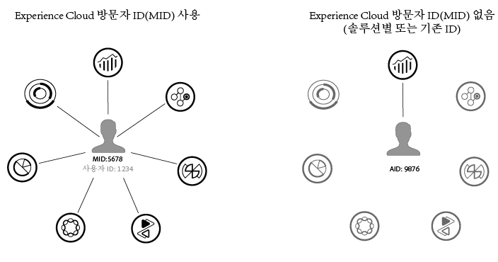

# ID 서비스에 대한 정보{#aboutidservice}

Adobe Experience Cloud에서 Experience Cloud ID 서비스의 역할입니다.

<!--
mcvid-functionality.xml
-->

## Experience Cloud ID 서비스: 핵심 서비스의 기본 요소 {#section-2de0eb1d65664e92a4d8bbb167b84bde}

Experience Cloud ID 서비스를 통해 사용자 핵심 서비스의 Experience Cloud 핵심 서비스, 솔루션, 고객 속성 및 대상에 공통된 ID 프레임워크를 사용할 수 있습니다. 이는 영구적인 고유 ID를 사이트 방문자에게 할당하여 작동됩니다. 조직에서 ID 서비스를 구현하면 이 ID를 통해 다른 Experience Cloud 솔루션에서 동일한 사이트 방문자와 해당 데이터를 식별할 수 있습니다.

또한 ID 서비스는 다양한 솔루션별 ID(예: Analytics AID)를 대체할 수 있습니다. ID 서비스에서는 [고객 ID 및 인증 상태](../mcvid-reference/mcvid-authenticated-state.md) 기능인 ID 서비스를 사용하여 고유한 고객 ID를 [!DNL Experience Cloud]에 전달할 수 있습니다. 그렇지만 ID 서비스는 사용자가 이미 구독한 솔루션에서만 작동합니다. 따라서 등록하지 않은 제품에는 액세스할 수 없습니다.

나아가 ID 서비스는 현재 및 미래의 수 많은 [!DNL Experience Cloud] 기능, 개선 사항 및 서비스의 필수 구성 요소입니다. 현재, ID 서비스는 [Analytics](http://www.adobe.com/kr/marketing-cloud/web-analytics.html), [Audience Manager](http://www.adobe.com/kr/marketing-cloud/data-management-platform.html) 및 [Target](http://www.adobe.com/kr/marketing-cloud/testing-targeting.html)을 지원합니다. [!DNL Adobe Experience Cloud] 장치 Co-op에 참여하려는 경우에도 ID 서비스가 필요합니다. ID 서비스를 구현하지 않았다면 지금이 바로 마이그레이션 전략을 시작할 적기입니다. ID 서비스의 중요성과 역할에 대한 자세한 내용은 [Experience Cloud ID 서비스가 나의 레이더가 되어야 하는 이유](http://blogs.adobe.com/digitalmarketing/analytics/why-new-adobe-marketing-cloud-id-service-should-be-on-your-radar/)를 참조하십시오.

## 기능 요약 {#section-96555473455c4bf8924c2d56ff4f3255}

합계를 표시하려면 ID 서비스에서 다음을 수행하십시오.

* 프로필 및 ID를 연결하는 데 사용할 수 있는 공통 키 또는 ID를 만듭니다.
* 여러 솔루션에서 장치를 고유하게 식별합니다.
* 동일한 도메인에서 추적할 수 있도록 고객의 도메인에서 퍼스트 파트 쿠키를 설정합니다. 자세한 내용은 [Experience Cloud](../mcvid-introduction/mcvid-cookies.md).
* [!DNL Experience Cloud] 고객 및 파트너로부터 별칭 및 ID 매핑을 받습니다.
* [!DNL Experience Cloud] 내에서 ID 동기화를 관리합니다.
* 광고 기술 에코 시스템에서 다른 타사와 ID 동기화를 지원합니다.
