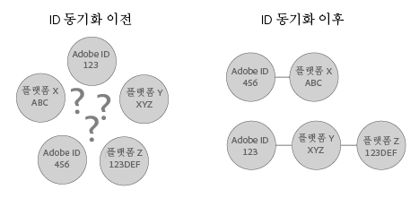

# ID 동기화 및 일치 비율 이해{#understanding-id-synchronization-and-match-rates}

Adobe Media Optimizer 및 ID 서비스를 비롯한 Experience Cloud ID 서비스의 ID 동기화 프로세스 및 일치율에 대한 개요입니다.

## ID 동기화 및 일치 비율 {#section-f652aae7234945e89d26dd833c5215fb}

ID 동기화는 ID 서비스에서 할당한 ID와 고객이 사이트 방문자에게 할당한 ID를 일치시킵니다. 예를 들어 ID 서비스에서 방문자에게 ID 1234를 할당했다고 가정해 보겠습니다. 다른 플랫폼에서는 이 방문자를 ID 4321로 인지합니다. ID 서비스는 동기화 프로세스 중에 이러한 ID를 함께 매핑합니다. 결과적으로 고객이 사이트 방문자에 대해 알고 있는 사항에 새로운 데이터 포인트가 추가됩니다. ID 서비스에서 ID를 일치시킬 수 없으면 새 ID를 만들고 향후 동기화에 해당 ID를 사용합니다.

일치율은 ID 동기화 프로세스의 효율성을 측정하고 유효성을 검사합니다. 특정 서비스의 일치율이 높으면 일치율이 낮은 서비스보다 더 효과적이고 더 큰 규모의 온라인 고객에게 액세스할 수 있음을 나타냅니다. 일치율 비교는 다양한 통합 광고 기술 플랫폼을 평가할 수 있는 수량화 가능한 방법입니다.



**높은 일치 비율 보장**

높은 일치 비율을 생성하려면 ID 서비스를 적절히 설정해야 합니다 ( [표준 구현 안내서](../mcvid-implementation-guides/mcvid-standard.md#concept-89cd0199a9634fc48644f2d61e3d2445)참조). 적절하게 구현하면 ID 서비스가 작동하고 ID를 활성화된 데이터 파트너와 동기화하는 데 필요한 쿠키를 설정할 수 있으므로 높은 일치율을 보장하는 데 도움이 됩니다. 하지만 느린 인터넷 연결, 모바일 장치 또는 무선 네트워크의 데이터 수집 등과 같은 요인이 ID 서비스가 ID를 수집, 동기화 및 일치시키는 정도에 영향을 줄 수 있습니다. 이러한 클라이언트측 변수는 ID 서비스나 [!DNL Adobe]의 제어 범위를 벗어납니다.

## ID 동기화 프로세스 설명 {#section-a541a85cbbc74f5682824b1a2ee2a657}

ID 서비스는 ID를 실시간으로 동기화합니다. 이 프로세스는 서버 간 데이터 전송을 통해서가 아니라 브라우저에서 작동합니다. 다음 표에는 ID 동기화 프로세스의 단계가 설명되어 있습니다.

**1 단계: 페이지 로드**

방문자가 사이트를 방문하여 페이지를 로드하면 `Visitor.getInstance` 이 함수는 ID 서비스에 [대한 CORS](../mcvid-reference/mcvid-cors.md#concept-6c280446990d46d88ba9da15d2dcc758) 또는 JSON-P 호출을 수행합니다. ID 서비스는 방문자의 [!DNL Experience Cloud] ID(MID)를 포함하는 쿠키에 응답합니다. MID는 각 사이트 방문자에게 할당된 고유 ID입니다. 또한 [쿠키 및 ExExperience Cloud ID 서비스](../mcvid-introduction/mcvid-cookies.md).

**2단계: iFrame 로드**

페이지 본문을 로드하는 동안 ID 서비스가 *`Destination Publishing iFrame`*. 상위 페이지와 분리된 도메인에 [!DNL Destination Publishing iFrame] 있는 로드. 이러한 설계는 iFrame의 다음과 같은 특성으로 인해 페이지 성능을 보장하고 보안을 강화하는 데 도움이 됩니다.

* 상위 페이지와 관련하여 비동기적으로 로드됩니다. 이것은 상위 페이지가와 독립적으로 로드할 수 있음을 의미합니다 [!DNL Destination Publishing iFrame]. iFrame 로드와 iFrame 내부의 ID 동기화 픽셀 로드는 상위 페이지나 사용자 경험에 영향을 주지 않습니다. 
* 가능한 신속하게 로드됩니다. 너무 속도가 빠른 경우, 창 로드 이벤트 이후에 iFrame을 로드할 수 있습니다(권장하지 않음). 를 참조하십시오. [idSyncAttachIframeOnWindowLoad](../mcvid-library/mcvid-function-vars/mcvid-idsyncattachiframeonwindowload.md#reference-b86b7112e0814a4c82c4e24c158508f4)를 참조하십시오.
* iFrame의 코드가 상위 페이지에 대한 액세스 권한을 확보하거나 영향을 주지 않도록 방지합니다.

또한 [Experience Cloud ID 서비스에서 ID를 요청하고 설정하는 방법...](../mcvid-introduction/mcvid-id-request.md#concept-2caacebb1d244402816760e9b8bcef6a).

**3단계: ID 동기화 실행**

ID 동기화는 대상 게시 iFrame에서 실행되는 URL입니다. 이 일반적인 예제에서 알 수 있듯이 ID 동기화 URL에는 파트너의 ID 동기화 종단점 및 ID를 포함하여 [!DNL Adobe])로 리디렉션되는 리디렉션 URL이 포함되어 있습니다.

```
http://abc.com?partner_id=abc&sync_id=123&redir=http://dpm.demdex.net/ibs:dpid=<
<varname>
  ADOBE_PARTNER_ID
</varname>>&dpuuid=<
<varname>
  PARTNER_UUID
</varname>>
```

또한 [인바운드 데이터 전송을 위한 ID 동기화](https://marketing.adobe.com/resources/help/en_US/aam/c_id_sync_in.html)를 참조하십시오.

**4단계: ID 저장**

동기화된 ID는 [에지 및 코어 데이터 서버](https://marketing.adobe.com/resources/help/en_US/aam/c_compedge.html)에 저장됩니다.

## 서비스 동기화를 통해 ID 동기화 관리 {#section-cd5784d7ad404a24aa28ad4816a0119a}

이 용어는 *`Sync Services`* ID 동기화를 담당하는 내부 [!DNL Experience Cloud] 기술을 나타냅니다. 이 서비스는 기본적으로 활성화되어 있습니다. 비활성화하려면 [선택적 변수](../mcvid-library/mcvid-function-vars/mcvid-disableidsync.md#reference-589d6b489ac64eddb5a7ff758945e414)를 ID 서비스 `Visitor.getInstance` 함수에 추가합니다. 동기화 서비스는 다음과 같은 [!DNL Experience Cloud] 다른 ID와 일치합니다.

* 타사 [!DNL Experience Cloud] ID에 대한 타사 쿠키 [!DNL Experience Cloud] ID.

* 퍼스트 파티 [!DNL Experience Cloud] 쿠키 ID ( [!DNL Adobe Media Optimizer] AMO) ID.

* 타사 [!DNL Experience Cloud] 쿠키 ID와 타사 데이터 제공업체 및 타깃팅 플랫폼 ID. 데이터 제공업체, 수요측 및/또는 공급측 플랫폼, 광고 네트워크, 교환 등과 같은 서비스 및 플랫폼이 이에 해당합니다.
* 장치 간 파트너 ID에 대한 퍼스트 파티 [!DNL Experience Cloud] 쿠키 ID.

## Adobe Media Optimizer와 ID 동기화 {#section-642c885ea65d45ffb761f78838735016}

[!DNL Adobe Media Optimizer] 은 iframe 기반 ID 동기화 프로세스에 대한 예외입니다. 는 신뢰할 수 있는 도메인이므로 [!DNL Media Optimizer] ID 동기화가 이 아닌 상위 페이지에서 이루어집니다 [!DNL Destination Publishing iFrame]. 동기화 동안, 에서 ID 서비스가 호출되며, [!DNL Media Optimizer] 이것은 `cm.eversttech.net`Adobe가 가져오기 전에 [!DNL Media Optimizer] 사용한 이전 도메인 이름입니다. 데이터를 [!DNL Media Optimizer]로 보내면 일치율이 향상되고, 버전 2.0 이상을 사용하는 ID 서비스 고객의 경우 자동으로 사용됩니다. [Media Optimizer 쿠키](https://marketing.adobe.com/resources/help/en_US/whitepapers/cookies/cookies_media_optimizer.html)를 참조하십시오.

>[!MORE_ like_ this]
>
>* [Demdex 도메인에 대한 호출 이해](https://marketing.adobe.com/resources/help/en_US/aam/demdex-calls.html)

